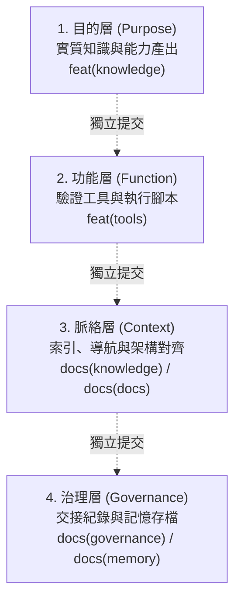

# 📝 原子化提交與四權分立規則 (Atomic Commit & 4-Tier Separation Rules)

> 本規範為專案核心治理原則，所有分支開發、PR 提交與 AI Agent 協作皆須 100% 嚴格遵守。
> CI 閘門（`.github/workflows/policy.yml`）會對所有 commit 標題與變更進行強制驗證。

---

## 1. 核心語法規範 (Conventional Commits)

所有 Commit 標題必須嚴格符合以下正則表達式，且長度**不得超過 72 字元**：

```regex
^(feat|fix|refactor|docs|test|chore|style|perf|security)(?:\((study|plan|ctfd|labs|challenge|plugin|core|web|ui|docs|ci|deps|sec|agent|infra|build|release|governance|tracks|practice|tools|knowledge|memory|deepsource|links)\))?: [a-z0-9].*$
```

### 1.1 格式要求
- **結構**：`<type>(<scope>): <subject>` 或 `<type>: <subject>`（建議一律加上 scope）。
- **小寫開頭**：`<subject>` 必須以英文字母小寫或數字開頭（如 `feat(knowledge): add...`，不可大寫 `Add`）。
- **禁止句點**：結尾**絕對不可帶有句號 `.`**。
- **長度限制**：包含 type, scope, subject 總長度 **$\le 72$ 字元**。
- **禁止空泛**：禁止使用 `update`, `misc`, `changes`, `fix bug`, `stuff` 等模糊詞彙。

### 1.2 白名單 Scope 對照
| Scope | 適用領域 |
|---|---|
| `knowledge` | 資安知識庫、攻擊防禦 Playbooks、Matrix 內容 |
| `tools` | 驗證腳本、自動化工具、產生器代碼與產出物 |
| `governance` | 專案治理、規範文檔、交接清單 (`HANDOVER.md` 等) |
| `memory` | Agent 記憶庫狀態 (`MEMORY.md` 等) |
| `docs` | 架構索引、導航目錄、全域 `README.md` |
| `sec` / `infra` | 安全策略、基礎架構配置 |
| `ci` | GitHub Actions 工作流 (`policy.yml` 等) |
| `labs` / `challenge` | 實體實驗室與靶場環境配置 |

---

## 2. 四權分立架構 (Surgical 4-Tier Separation)

為了維護 Git 歷史的乾淨度、回滾（Revert）的安全性與代碼審查的高效性，任何修改必須拆解為四個維度，**禁止混裝於同一 Commit**：



### 2.1 第一層：目的層 (Purpose / Knowledge Asset)
- **核心職責**：代表該次任務的「業務/學術成果本體」。
- **包含範疇**：Playbook 正文、攻擊/防禦手冊、Purple Matrix 映射表。
- **Commit 範例**：
  - `feat(knowledge): add blue team incident response playbooks`
  - `feat(knowledge): add purple team attack defense matrix`

### 2.2 第二層：功能層 (Function / Tooling & Artifacts)
- **核心職責**：為目的層提供自動化校驗、生成、轉換的工具與腳本。
- **包含範疇**：Python 腳本 (`validate_*.py`、`generator.py`)、編譯產出的 JSON Layer 檔案。
- **Commit 範例**：
  - `feat(tools): add blue team playbook validation script`
  - `feat(tools): add purple team navigator layer generator`

### 2.3 第三層：脈絡層 (Context / Architecture & Navigation)
- **核心職責**：將新成果接入整個專案的知識網路，確保路徑可達性與全局一致性。
- **包含範疇**：專案首頁 `README.md` 索引、模組目錄 `index.md`、學習路徑 `career_curriculum.md`。
- **Commit 範例**：
  - `docs(docs): link blue team playbooks in root and security readme`
  - `docs(knowledge): add purple team overview to knowledge index`

### 2.4 第四層：治理層 (Governance / Handover & Memory)
- **核心職責**：記錄協作進度、工作階段狀態、Agent 記憶與交接事項。
- **包含範疇**：`docs/HANDOVER.md`、`.agent/` 規則、`MEMORY.md`。
- **Commit 範例**：
  - `docs(governance): update handover for purple team matrix delivery`
  - `docs(governance): update atomic commit rules for 4-tier separation`

---

## 3. 嚴禁搭便車原則 (Strict Anti-Piggybacking)

1. **嚴禁混合治理與功能**：絕對不得在提交 `feat(...)` 或 `fix(...)` 時，順手把 `HANDOVER.md` 或 `MEMORY.md` 放到同一個 commit 中。
2. **嚴禁混合工具與文檔**：生成工具腳本變更與手冊文檔撰寫必須各自成 commit，以便工具故障時可獨立 revert 而不影響知識內容。
3. **分階段 Staging**：
   - 務必使用 `git add <具體檔案>`，嚴禁直接使用無腦的 `git add -A` 或 `git add .`。
   - 在 `git commit` 前，使用 `git status` 與 `git diff --cached --name-only` 仔細檢驗暫存區檔案是否純粹。

---

## 4. 本地檢查與驗證工作流

在推送任何分支前，必須執行本機校驗腳本：

```powershell
# 1. 驗證所有 commit 標題與長度符合政策
python security/tools/lint_commits.py --base origin/main

# 2. 驗證所有資安手冊與雙向連結
python security/tools/validate_playbooks.py --all
```
