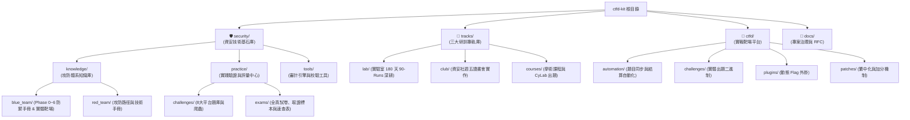

# 🛡️ NCtfU 資安研訓平台與技術知識庫 (NCtfU Security Platform & Knowledge Base)

[](LICENSE)
[](#-專案三大核心支柱-three-architectural-pillars)
[](ctfd/)
[](tracks/)

> 本專案為兼具**「資安核心公共技術基石」**、**「三大研訓專軌體系」**與**「CTFd 實戰評測靶場」**之綜合性資安工程體系。

---

## 🏛️ 專案三大核心支柱 (Three Architectural Pillars)



```text
ctfd-kit/
│
├── 🛡️ security/           # 【資安核心技術知識庫】(全體共享技術基石)
│   ├── knowledge/         # 📚【攻防體系知識庫】
│   │   ├── blue_team/     # 🔵 藍隊體系 (Phase 0~6 課表、31 大路徑、107 篇手冊、Phase 6 實體靶場 ranges/)
│   │   └── red_team/      # 🔴 紅隊體系 (攻防手法、武器庫索引、對稱學習路徑與劇本)
│   ├── practice/          # 🎯【實踐驗證與評量中心】
│   │   ├── challenges/    # 題庫中心 (8 大平台實戰題庫 3,945+ 關卡與同步爬蟲)
│   │   └── exams/         # 評量中心 (金盾/技能競賽 A/B 卷、取證標本 evidence/、Cheatsheets)
│   └── tools/             # 🛠️ 作戰工具庫 (Playbook 校驗器、Code Auditor 程式碼審計引擎)
│
├── 🚀 tracks/             # 【三大研訓專軌庫】(實施方案與日程對齊)
│   ├── lab/               # 🧪 實驗室深耕計畫 (90-Runs 課表與地圖、金盾衝刺、HITCON 實戰案例)
│   ├── club/              # 👥 NCtfU 資安社讀書會 (週五雙軌自適應課表、CTF 出國戰略指南)
│   └── courses/           # 🎓 大學學術課程專軌 (中央資管《電腦網路安全》與 CyLab 出題指南)
│
├── 🎯 ctfd/               # 【CTFd 實戰靶場與演練模組】(線上評測平台)
│   ├── assets/            # 競賽認證範本、校園圖片素材
│   ├── automation/        # 平台自動化維運與結算腳本 (sync_challenges.py, send_final_top10.py)
│   ├── challenges/        # 靶機題目源碼 (C/Reverse) 與二進制檔
│   ├── database/          # CTFd 初始化資料庫結構與預設帳密 dump
│   ├── patches/           # CTFd 核心繁中化與首殺加分補丁
│   ├── plugins/           # dynamic_shuffle_flag 動態 Flag 外掛
│   ├── event_guide.md     # 🏆 NCU 資管碩一 Mini-CTF 活動手冊暨 Write-Up
│   └── install.sh         # 一鍵快速部署至目標 CTFd 伺服器
│
└── 📜 docs/               # 【專案治理與架構規範】
    └── rfc/               # 0001_architecture_redesign_rfc.md 架構演進提案
```

---

## 🧭 快速導覽與指引 (Quick Navigation)

| 需求場景 | 目標指引路徑 | 說明 |
| :--- | :--- | :--- |
| **藍隊實戰與防禦應變** | [`security/knowledge/blue_team/`](security/knowledge/blue_team/) | 涵蓋 SOC、威脅獵捕、數位鑑識 (DFIR) 等 107 本手冊與 7 階段課表 |
| **紅隊攻擊與武器庫** | [`security/knowledge/red_team/`](security/knowledge/red_team/) | 包含 Web 滲透、內網橫向移動、紅隊劇本與學習路徑 |
| **全真模擬考與金盾準備** | [`security/practice/exams/`](security/practice/exams/) | 包含模擬試卷 A/B 卷全解析、速記卡與命題大綱 |
| **靶場實戰題目演練** | [`security/practice/challenges/`](security/practice/challenges/UNIFIED_FREE_CHALLENGES_INDEX.md) | 匯整 8 大主流攻防平台 (HTB, THM, CyberDefenders 等) 3,945+ 免費題庫索引 |
| **實驗室深耕成長** | [`tracks/lab/90_runs/`](tracks/lab/90_runs/) | 180 天 90-Runs 課表、HITCON Range 靶場與金盾奪標計畫 |
| **資安社週五讀書會** | [`tracks/club/`](tracks/club/) | 每週雙軌實作課表、Discord 分流、競賽培訓與 CTF 攻略 |
| **學術課程與出題專軌** | [`tracks/courses/`](tracks/courses/) | 中央資管陳奕明教授《電腦網路安全》14 週課表對照與 CyLab 出題手冊 |
| **CTFd 部署與維運** | [`ctfd/`](ctfd/) | 包含自動化結算、動態 Flag 外掛、繁中補丁、活動指南與一鍵部署腳本 |

---

## 規範與貢獻指南 (Standards & Conventions)

- **命名規範**：所有目錄與檔案均採用小寫蛇形命名法 (`lower_snake_case`)，嚴禁使用舊版 `A0_`~`A3_` 等無語意前綴與空白字元。
- **路徑可移植性**：嚴格禁止硬編碼本機絕對路徑（如 `f:\...` 或 `file:///...`），所有內部文檔交互參照一律使用**相對路徑**。
- **原子化提交 (Atomic Commits)**：提交遵循 Conventional Commits 規範，範圍限定於 `sec`、`tracks`、`ctfd`、`docs`、`chore` 等合法 scope。

