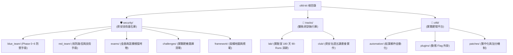

# 🛡️ NCtfU 資安研訓平台與技術知識庫 (NCtfU Security Platform & Knowledge Base)

[](LICENSE)
[](#-專案三大核心支柱-three-architectural-pillars)
[](ctfd/)
[](tracks/)

> 本專案為兼具**「資安核心公共技術基石」**、**「雙軌研訓執行計畫」**與**「CTFd 實戰評測靶場」**之綜合性資安工程體系。

---

## 🏛️ 專案三大核心支柱 (Three Architectural Pillars)



```text
ctfd-kit/
│
├── 🛡️ security/           # 【資安核心技術知識庫】(全體共享技術基石)
│   ├── framework/         # 全域架構地圖、檔案索引、文檔命名與貢獻規範
│   ├── blue_team/         # 🔵 藍隊體系 (Phase 0~6 階段課表、31 大學習路徑、41 本原子手冊)
│   ├── red_team/          # 🔴 紅隊體系 (攻防手法、武器庫索引、對稱學習路徑與劇本)
│   ├── challenges/        # 🎯 靶場與實戰題庫 (picoCTF, PortSwigger, CyLab, HITCON Wargame)
│   ├── exams/             # 📝 全真模擬考卷 (金盾/技能競賽 A/B 卷題本與解析、速記卡)
│   └── notes/             # ⚡ 基礎考點名詞速查、網路安全指令速查
│
├── 🚀 tracks/             # 【雙軌執行計畫庫】(實施方案與日程對齊)
│   ├── lab/               # 🧪 實驗室專屬深耕計畫 (180 天 90-Runs、金盾衝刺、HITCON Range)
│   └── club/              # 👥 NCtfU 資安社讀書會 (週五讀書會簡表、每週實作課表、目標規劃)
│
└── 🎯 ctfd/               # 【CTFd 實戰靶場與演練模組】(線上評測平台)
    ├── automation/        # 賽後自動化結算信件寄送腳本
    ├── challenges/        # 靶機題目源碼 (C/Zig) 與同步工具
    ├── database/          # CTFd 初始化資料庫結構與預設帳密 dump
    ├── patches/           # CTFd 核心繁中化與首殺加分補丁
    ├── plugins/           # dynamic_shuffle_flag 動態 Flag 外掛
    └── install.sh         # 一鍵快速部署至目標 CTFd 伺服器
```

---

## 🧭 快速導覽與指引 (Quick Navigation)

| 需求場景 | 目標指引路徑 | 說明 |
| :--- | :--- | :--- |
| **藍隊實戰與防禦應變** | [`security/blue_team/`](security/blue_team/) | 涵蓋 SOC、威脅獵捕、數位鑑識 (DFIR) 等 41 本手冊與 7 階段課表 |
| **紅隊攻擊與武器庫** | [`security/red_team/`](security/red_team/) | 包含 Web 滲透、內網橫向移動、紅隊劇本與學習路徑 |
| **全真模擬考與金盾準備** | [`security/exams/`](security/exams/) | 包含模擬試卷 A/B 卷全解析、速記卡與命題大綱 |
| **靶場實戰題目演練** | [`security/challenges/`](security/challenges/) | 匯整 PicoCTF、PortSwigger 與 CyLab 實作靶題 |
| **實驗室深耕成長** | [`tracks/lab/90_runs/`](tracks/lab/90_runs/) | 180 天 90-Runs 課表、HITCON Range 靶場與金盾奪標計畫 |
| **資安社週五讀書會** | [`tracks/club/`](tracks/club/) | 每週主題實作課表、CTF 入門與讀書會計畫 |
| **CTFd 部署與維運** | [`ctfd/`](ctfd/) | 包含自動化結算、動態 Flag 外掛、繁中補丁與一鍵部署腳本 |

---

## 規範與貢獻指南 (Standards & Conventions)

- **命名規範**：所有目錄與檔案均採用小寫蛇形命名法 (`lower_snake_case`)，嚴禁使用舊版 `A0_`~`A3_` 等無語意前綴與空白字元。
- **路徑可移植性**：嚴格禁止硬編碼本機絕對路徑（如 `f:\...` 或 `file:///...`），所有內部文檔交互參照一律使用**相對路徑**。
- **原子化提交 (Atomic Commits)**：提交遵循 Conventional Commits 規範，範圍限定於 `sec`、`tracks`、`ctfd`、`docs`、`chore` 等合法 scope。

