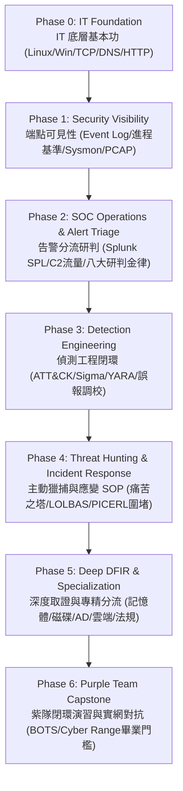

# 🚀 現代藍隊實戰通關課表與作戰主線 (Blue Team Career & Operational Curriculum)

> 💡 **核心精神**：本文件將 [`index.md`](index.md) 的 31 大領域與 107 項技術點，由「百科全書式的資源索引」昇華為**「以 SOC 營運與實戰事件為核心的修課主線」**。
>
> **徹底打破「難度 (Level) 等同於學習順序 (Phase)」的迷思**，讓學習者知道第一天該學什麼、第三十天該做什麼，以及如何一步一步達到真正的藍隊畢業水準。
>
> 🛡️ **配套實戰題庫**：所有 82 題官方認證 100% 免費題庫與各階段/領域的對應指引，請參閱 [【CyberDefenders 全量 82 題免費實戰靶場・31 大學習路徑深度對照手冊】](learning_paths/cyberdefenders_free_catalog_mapping.md)。

---

## 🧭 藍隊修課七大階段 (Phase 0 ~ Phase 6) 全景流向



---

## 🎯 學習負擔消解：三層能力分類 (Core / Specialization / Advanced)

面對 107 項技術點，**不需要一次全部學完**！請依據三層分流逐步推進：

| 能力層級 | 包含項數 | 核心定位與目標 | 適合對象 |
| :--- | :---: | :--- | :--- |
| **🎯 核心主幹 (Core Track)** | **36 項** | 建立可見性、SOC 告警研判、基礎封包與事件應變能力的**絕對必修**。只要掌握這 36 項，即具備 SOC L1 分析師與金盾獎初賽主力得分實力！ | 所有新手、即將參賽者、SOC 轉職者 |
| **🔬 領域專精 (Specialization Track)** | **46 項** | 深度記憶體鑑識、磁碟 $MFT 鐵證、AD 網域進階攻防、重大 CVE 逆推、資通法規與個資法。按個人興趣與隊伍分工選修。 | DFIR 取證專員、紅藍對抗主力、法規稽核員 |
| **🚀 高階與前沿 (Advanced Track)** | **25 項** | Linux 核心 eBPF、行動裝置取證、K8s 容器逃逸、微隔離 NGFW、全自動化紫隊閉環測試。 | 資深架構師、Purple Teamer、競賽爭冠選手 |

---

## 🏁 Phase 0: IT Foundation & Operational Primitives (打底與基本功)

> 💡 **階段目標**：不碰高深的攻擊工具，先搞清楚正常系統與網路是如何運作的。
> ⚠️ **新手陷阱**：第一天就去碰 Kubernetes、SBOM、WPA3、SNMP 或 OAuth 攻擊，容易直接被龐雜概念淹沒。

### 必修核心清單
1. **Linux 系統基礎加固**（對應技術點：`1.1`, `1.2`）：
   - **1.1 Linux 權限模型與敏感檔案檢視**：`/etc/passwd`, `/etc/shadow`, Umask, SUID/SGID 特殊提權位元。
   - **1.2 Linux 連線狀態與服務進程排查**：熟練使用 `ss -antup`, `ps -ef`, `lsof -i` 查看網路連線與進程。
2. **網路協定與封包分析**（對應技術點：`6.1`, `6.2`, `6.3`, `6.4`）：
   - **6.1 TCP 協定棧與三向交握狀態機**：SYN / SYN-ACK / ACK 狀態機，RST 異常中斷與 SYN Flood。
   - **6.2 HTTP 明文串流重組與檔案導出**：請求方法 (GET/POST)、標頭、狀態碼，TCP Stream 還原。
   - **6.3 DNS 基礎查詢解析與異常頻率排查**：A/AAAA/TXT/PTR 查詢，遞迴查詢與 NXDOMAIN 異常頻率。
   - **6.4 ICMP/ARP 區域網路掃描與嗅探特徵**：ARP 廣播與 MAC-IP 映射原理、ARP 欺騙偵測。
3. **密碼學基礎與證書安全**（對應技術點：`11.1`, `11.2`）：
   - **11.1 TLS 憑證鏈驗證與加密傳輸**：X.509 憑證階層、CA 數位簽章與 OCSP 撤銷機制。
   - **11.2 雜湊演算法完整性檢驗與碰撞辨析**：SHA-256 與 HMAC 計算，單向性與雪崩效應。

---

### 📋 Phase 0 技術點實戰矩陣

> 🎯 **本階段通關目標**：搞定作業系統底層、核心網路協定與密碼學基礎，不碰複雜攻防，建立不可或缺的防衛地基。

| 技術點編號與名稱 | 難度 | 核心定位 (Track) | 學習目標與驗收指標 | 對應深度指南 |
| :--- | :---: | :---: | :--- | :--- |
| **1.1 Linux 權限模型與敏感檔案檢視** | 🟢 L1 | **🎯 Core 核心必修** | 掌握 SUID/SGID/Sticky 提權位元與 /etc/shadow 雜湊格式 | [📘 1.1 實戰手冊](playbooks/phase_0_foundation/01.1_linux_auth_pam_sudoers.md) |
| **1.2 Linux 連線狀態與服務進程排查** | 🟢 L1 | **🎯 Core 核心必修** | 熟練使用 `ss -antup`, `ps -ef`, `lsof -i` 定位異常監聽埠與進程 | [領域 01 手冊](learning_paths/block_1_hardening/01_linux_hardening.md) |
| **6.1 TCP 協定棧與三向交握狀態機** | 🟢 L1 | **🎯 Core 核心必修** | 掌握 SYN/ACK/RST 狀態機流向與 Wireshark Hex 旗標定位 | [📘 6.1 實戰手冊](playbooks/phase_0_foundation/06.1_wireshark_tcp_handshake.md) |
| **6.2 HTTP 明文串流重組與檔案導出** | 🟢 L1 | **🎯 Core 核心必修** | 熟練操作 `Follow -> TCP Stream` 還原請求並導出惡意檔案 | [領域 06 手冊](learning_paths/block_2_protocols_crypto_app/06_network_protocols_packet_analysis.md) |
| **6.3 DNS 基礎查詢解析與異常頻率排查** | 🟢 L1 | **🎯 Core 核心必修** | 理解 A/AAAA/TXT/PTR 解析邏輯與 NXDOMAIN 異常頻率 | [📘 6.3 實戰手冊](playbooks/phase_0_foundation/06.3_http_tls_ja3_fingerprint.md) |
| **6.4 ICMP/ARP 區域網路掃描與嗅探特徵** | 🟢 L1 | **🎯 Core 核心必修** | 識別 ARP 廣播請求與單一 MAC 冒充閘道之欺騙行為 | [領域 06 手冊](learning_paths/block_2_protocols_crypto_app/06_network_protocols_packet_analysis.md) |
| **11.1 TLS 憑證鏈驗證與加密傳輸** | 🟢 L1 | **🎯 Core 核心必修** | 理解 X.509 憑證階層、CA 數位簽章與 OCSP 撤銷機制 | [領域 11 手冊](learning_paths/block_2_protocols_crypto_app/11_cryptography_certificates.md) |
| **11.2 雜湊演算法完整性檢驗與碰撞辨析** | 🟢 L1 | **🎯 Core 核心必修** | 掌握 SHA-256 與 HMAC 計算，理解單向性與雪崩效應 | [領域 11 手冊](learning_paths/block_2_protocols_crypto_app/11_cryptography_certificates.md) |

---

## 📡 Phase 1: Security Visibility & Endpoint Telemetry (端點與網路可見性 - 藍隊真正起點)

> 💡 **階段目標**：**「你看不到的東西，你就無法防禦。」** 建立主機日誌與網路側錄的可見性，學會區分「正常」與「異常」。

### 必修核心清單
1. **Windows 核心驗證日誌**（對應技術點：`14.1`）：
   - **Event ID 4624 (登入成功)**：熟記 **Logon Type 2 (本機互動)**、**Logon Type 3 (網路共享/SMB)**、**Logon Type 10 (遠端桌面 RDP)**。
   - **Event ID 4625 (登入失敗)**：識別暴力破解攻擊特徵與錯誤代碼 (如 `0xC000006A` 密碼錯誤)。
2. **Windows 進程親緣關係基準線**（對應技術點：`14.2`）：
   - 掌握 Windows 核心進程樹標準：`System (PID 4)` ➔ `smss.exe` ➔ `wininit.exe` / `csrss.exe` ➔ `services.exe` / `lsass.exe` ➔ `svchost.exe`。
   - 辨識偽裝手法：`svch0st.exe`、非 System32 目錄下的系統進程、`explorer.exe` 作為 `lsass.exe` 父進程等極度異常現象。
3. **進程建立與服務安裝審計**（對應技術點：`14.3`）：
   - **Event ID 4688 (進程建立)**：必須配置 GPO 啟用「命令列參數記錄 (Include Command Line)」。
   - **Event ID 7045 (新服務安裝)**：偵測 PsExec 橫向移動與惡意持久化服務建立。
4. **Sysmon 驅動級深度遙測**（對應技術點：`18.1`）：
   - **Event ID 1**：進程建立（含 SHA256 雜湊與工作目錄）。
   - **Event ID 3**：網路連線（進程綁定連線 IP/Port）。
   - **Event ID 7**：模組載入（偵測 DLL 劫持）。
   - **Event ID 8**：CreateRemoteThread（偵測代碼注入）。
5. **Wireshark 封包深度排查實務**（對應技術點：`6.1`, `6.2`）：
   - 熟練使用 Display Filter 過濾特定 IP 與 Port。
   - 熟練操作 `Follow -> TCP Stream` 還原通訊內容與 `Export Objects` 導出傳輸檔案。

---

### 📋 Phase 1 技術點實戰矩陣

> 🎯 **本階段通關目標**：建立「你看得到東西」的能力！掌握 Windows 核心日誌、進程親緣基準線、Sysmon 遙測與 Web 基礎弱點特徵。

| 技術點編號與名稱 | 難度 | 核心定位 (Track) | 學習目標與驗收指標 | 對應深度指南 |
| :--- | :---: | :---: | :--- | :--- |
| **1.3 帳號安全與 SSH 遠端登入硬化** | 🟢 L1 | 🔬 Specialization | 完成 SSH 僅金鑰登入加固與 PAM 暴力破解防禦設置 | [📘 1.3 實戰手冊](playbooks/phase_1_visibility/01.3_linux_ssh_pam_fail2ban.md) |
| **1.4 排程作業與自啟動項排查** | 🟢 L1 | **🎯 Core 核心必修** | 清查 Crontab、systemd 定時器與 `/etc/ld.so.preload` 隱藏後門 | [📘 1.4 實戰手冊](playbooks/phase_1_visibility/01.4_linux_cron_systemd_persistence.md) |
| **9.1 注入類漏洞流量特徵與防禦 (SQLi)** | 🟢 L1 | **🎯 Core 核心必修** | 識別 SQL 注入封包特徵，理解 Prepared Statements 預編譯防護 | [📘 9.1 實戰手冊](playbooks/phase_1_visibility/09.1_web_sqli_command_injection.md) |
| **9.2 檔案路徑穿越與 XML 外部實體特徵** | 🟢 L1 | **🎯 Core 核心必修** | 辨識 `..%2f` 目錄穿越特徵，掌握 XXE 外部實體解析防護 | [📘 9.2 實戰手冊](playbooks/phase_1_visibility/09.2_web_path_traversal_xxe.md) |
| **9.3 跨站腳本與請求偽造防範 (XSS/CSRF)**| 🟢 L1 | **🎯 Core 核心必修** | 熟記 `HttpOnly`, `SameSite`, `CSP` 防護標頭之實務效果 | [📘 9.3 實戰手冊](playbooks/phase_1_visibility/09.3_web_xss_csrf_defense.md) |
| **9.4 敏感資訊洩漏與目錄遍歷** | 🟢 L1 | **🎯 Core 核心必修** | 能在 Nginx/Apache 日誌中定位未授權目錄探測痕跡 | [📘 9.4 實戰手冊](playbooks/phase_1_visibility/09.4_web_info_leak_directory_listing.md) |
| **14.1 Windows 身分驗證與暴力破解日誌** | 🟢 L1 | **🎯 Core 核心必修** | 熟記 Event ID 4624 登入類型 (2/3/10) 與 4625 爆破錯誤碼 | [📘 14.1 實戰手冊](playbooks/phase_1_visibility/14.1_windows_logon_4624_4625.md) |
| **14.2 Windows 正常核心進程基準線** | 🟢 L1 | **🎯 Core 核心必修** | 30 秒內默背 `System` ➔ `smss` ➔ `services` 親緣樹標準 | [📘 14.2 實戰手冊](playbooks/phase_1_visibility/14.2_windows_core_processes_baseline.md) |
| **14.3 基礎系統管理與服務安裝日誌** | 🟢 L1 | **🎯 Core 核心必修** | 監控 Event ID 7045 新服務安裝與 4688 命令列完整記錄 | [📘 14.3 實戰手冊](playbooks/phase_1_visibility/14.3_windows_events_7045_4688.md) |
| **14.4 防毒與主機防護日誌鑑識 (Defender)**| 🟢 L1 | **🎯 Core 核心必修** | 解析 Defender Event ID 1116 告警與 1117 隔離紀錄 | [📘 14.4 實戰手冊](playbooks/phase_1_visibility/14.4_windows_defender_operational_logs.md) |
| **18.1 Sysmon 驅動級進程遙測與命令行** | 🔴 L3 | **🎯 Core 核心必修** | 熟練運用 Sysmon Event ID 1/3/7/8 捕捉 Shellcode 注入行為 | [📘 18.1 實戰手冊](playbooks/phase_1_visibility/18.1_sysmon_process_telemetry_events.md) |

---

## 📊 Phase 2: SOC Analyst Operations & Alert Triage (告警研判、樞紐分析與判定)

> 💡 **階段目標**：面對 SIEM 大量告警，能在 5 分鐘內完成分流研判，區分誤報 (False Positive) 與真實威脅 (True Positive)。

### 1. SOC 告警分流八問黃金方法論 (The 8 Golden Questions)
當 SIEM 觸發一條告警時，分析師必須依序回答以下八個問題：
```text
1. What happened?      — 告警規則名稱與觸發的具體行為（例：PowerShell 下載可執行檔）
2. When?              — 精確觸發時間戳與事件持續時長
3. Which host & user? — 受害主機名稱、IP、網段，以及執行的使用者帳號特權層級
4. Parent & Child?    — 啟動該程序的父進程與後續衍生子進程（親緣關係是否合規）
5. Network & IOCs?    — 外連目的 IP/Port、域名、URL，是否符合已知威脅情報
6. Persistence?       — 磁碟有無新增註冊表 RunKey、排程作業、新安裝服務
7. Scope & Lateral?   — 內網其他主機是否收到相同連線或存在異常登入 (橫向移動)
8. Verdict & Action   — 判定為誤報 (關閉 Ticket) 或真實事件 (啟動 IR 圍堵處置)
```

### 2. Splunk SPL 大數據分析核心技能（對應技術點：`15.1`, `15.2`）
- 掌握 SPL 查詢管道：`index=... sourcetype=... | rex ... | eval ... | stats ... | where ...`
- 經典統計聚合：計算特定使用者在過去 1 小時內的登入失敗次數，或統計高危命令列參數執行頻率。

### 3. 惡意流量與 C2 隱蔽通訊鑑識（對應技術點：`16.1`, `16.2`）
- **C2 心跳 (Beaconing) 與抖動 (Jitter)**：利用時間戳間隔方差分析，辨識週期性連線特徵。
- **DNS 隱蔽隧道 (DNS Tunneling)**：識別大量高長度隨機子網域與異常 TXT 紀錄查詢。

---

### 📋 Phase 2 技術點實戰矩陣

> 🎯 **本階段通關目標**：學會「分析告警」！使用 Splunk SPL 與八大黃金問題進行分流判定，辨析 C2 心跳與郵件社交工程。

| 技術點編號與名稱 | 難度 | 核心定位 (Track) | 學習目標與驗收指標 | 對應深度指南 |
| :--- | :---: | :---: | :--- | :--- |
| **2.1 邊界防火牆策略與微創阻斷實務** | 🟡 L2 | 🔬 Specialization | 掌握 Netfilter conntrack 狀態追蹤與精準阻斷高危連線 | [📘 02.1 實戰手冊](playbooks/phase_2_soc_triage/02.1_border_firewall_surgical_blocking.md) |
| **10.1 郵件認證協定與仿冒偵測 (SPF/DKIM)**| 🟢 L1 | **🎯 Core 核心必修** | 深入解析 SPF -all 與 DMARC reject 原則，防偽造寄件者 | [📘 10.1 實戰手冊](playbooks/phase_2_soc_triage/10.1_email_auth_spf_dkim_dmarc.md) |
| **10.2 釣魚郵件標頭與惡意附件初篩** | 🟢 L1 | **🎯 Core 核心必修** | 由下而上 (Bottom-Up) 逆推 EML `Received` 最底層真實發信 IP | [📘 10.2 實戰手冊](playbooks/phase_2_soc_triage/10.2_phishing_header_attachment_triage.md) |
| **10.4 QR Code 釣魚 (Quishing) 與跳轉識別**| 🟢 L1 | 🔬 Specialization | 還原 QR Code 混淆網址與中繼重定向釣魚鏈 | [📘 10.4 實戰手冊](playbooks/phase_2_soc_triage/10.4_quishing_redirect_chain_analysis.md) |
| **15.1 Splunk SPL 管道檢索與過濾最佳化** | 🟡 L2 | **🎯 Core 核心必修** | 熟練使用 `index`, `sourcetype`, `eval`, `where` 高效過濾 | [📘 15.1 實戰手冊](playbooks/phase_2_soc_triage/15.1_splunk_spl_pipeline_optimization.md) |
| **15.2 SPL 動態欄位提取與聚合統計分析** | 🟡 L2 | **🎯 Core 核心必修** | 使用 `rex` 正則提取自訂欄位，並以 `stats count by` 統計異常 | [📘 15.2 實戰手冊](playbooks/phase_2_soc_triage/15.2_spl_field_extraction_aggregation.md) |
| **15.3 關聯分析規則建立與告警門檻設計** | 🟡 L2 | **🎯 Core 核心必修** | 設計多來源關聯規則（如「爆破失敗多次隨後成功登入」告警）| [📘 15.3 實戰手冊](playbooks/phase_2_soc_triage/15.3_correlation_rules_threshold_tuning.md) |
| **16.1 DNS 隱蔽通道與外洩特徵鑑識** | 🟡 L2 | **🎯 Core 核心必修** | 在 PCAP 中辨識大量隨機高熵值子網域與 Base64 載荷 | [📘 16.1 實戰手冊](playbooks/phase_2_soc_triage/16.1_dns_tunneling_exfiltration_forensics.md) |
| **16.2 C2 心跳模式與週期抖動分析** | 🟡 L2 | **🎯 Core 核心必修** | 使用連線時間戳標準差方差分析，抓出 C2 Jitter 抖動規律 | [📘 16.2 實戰手冊](playbooks/phase_2_soc_triage/16.2_c2_beaconing_jitter_analysis.md) |
| **19.4 動態沙箱行為報告解讀** | 🔴 L3 | **🎯 Core 核心必修** | 解讀 Any.run / CAPEv2 沙箱報告之網絡連線與進程樹 | [📘 19.4 實戰手冊](playbooks/phase_2_soc_triage/19.4_dynamic_sandbox_report_triage.md) |
| **22.1 CVSS v3.1/v4.0 基本指標與評分計算**| 🟡 L2 | **🎯 Core 核心必修** | 熟練計算 AV, AC, PR, UI, Scope, CIA 向量公式權重分數 | [📘 22.1 實戰手冊](playbooks/phase_2_soc_triage/22.1_cvss_metrics_score_calculation.md) |

---

## 📝 Phase 3: Detection Engineering & Rule Lifecycle (偵測工程與簽章生命週期)

> 💡 **階段目標**：不再只是「看告警」，而是能夠依據威脅情資「自製告警規則」，並將誤報率降到最低。

### 1. 偵測工程標準閉環流程
```text
威脅情報 (TTPs / CVE) ──► 分析必要遙測 (Telemetry) ──► 提出偵測假說 (Hypothesis)
                                                             │
                                                             ▼
規則測試驗證 (Benign/Malicious) ◄── 轉譯實作 (Sigma/YARA/Suricata)
        │
        ▼
誤報調校 (FP Tuning) ──► 部署監控 ──► ATT&CK 覆蓋率評估
```

### 2. 核心實戰工具與規則編寫
- **YARA 檔案二進位簽章**（對應技術點：`17.1`）：針對 WebShell、惡意 PE 檔案特徵字串編寫規則。
- **Sigma 通用日誌偵測規則**（對應技術點：`17.2`）：使用通用 YAML 格式定義偵測邏輯，並使用 `sigmac` 轉譯至 Splunk SPL 或 Elastic KQL。
- **Suricata 網路入侵特徵**（對應技術點：`17.3`）：編寫基於封包內容與位移特徵的網路規則。
- **規則生命週期維護（核心必修！）**（對應技術點：`17.4`）：定期排查過時規則，根據業務變更設定排除清單 (Whitelist Tuning)。

---

### 📋 Phase 3 技術點實戰矩陣

> 🎯 **本階段通關目標**：從「被動看告警」升級為「主動寫規則」！掌握 Sigma、YARA、Suricata 規則撰寫與誤報調校。

| 技術點編號與名稱 | 難度 | 核心定位 (Track) | 學習目標與驗收指標 | 對應深度指南 |
| :--- | :---: | :---: | :--- | :--- |
| **2.3 次世代防火牆 (NGFW) 與 IPS 聯防** | 🟡 L2 | 🚀 Advanced | 部署 Suricata NFQUEUE 內聯模式實現特徵即時阻斷 | [📘 02.3 實戰手冊](playbooks/phase_3_detection_eng/02.3_ngfw_ips_suricata_inline.md) |
| **15.4 巨量資安日誌基準線與異常偏離偵測**| 🟡 L2 | 🔬 Specialization | 建立離峰時間存取與流量突增 Baseline 動態門檻模型 | [📘 15.4 實戰手冊](playbooks/phase_3_detection_eng/15.4_siem_baseline_anomaly_detection.md) |
| **16.3 知名 N-day 漏洞利用封包逆推** | 🟡 L2 | 🔬 Specialization | 逆推 Log4j JNDI 注入與 ActiveMQ OpenWire 封包載荷特徵 | [📘 16.3 實戰手冊](playbooks/phase_3_detection_eng/16.3_nday_packet_reverse_engineering.md) |
| **17.1 YARA 檔案二進位特徵碼規則撰寫** | 🟡 L2 | **🎯 Core 核心必修** | 撰寫包含 strings 與 condition 之高精確 WebShell 檢測簽章 | [📘 17.1 實戰手冊](playbooks/phase_3_detection_eng/17.1_yara_binary_rules_webshell.md) |
| **17.2 Sigma 通用日誌偵測規則與轉譯** | 🟡 L2 | **🎯 Core 核心必修** | 撰寫通用 YAML 偵測邏輯並無損轉譯為 Splunk SPL / Elastic KQL | [📘 17.2 實戰手冊](playbooks/phase_3_detection_eng/17.2_sigma_rules_transpilation.md) |
| **17.3 Snort/Suricata 網路入侵特徵撰寫** | 🟡 L2 | 🔬 Specialization | 掌握 `content`, `offset`, `depth` 語法撰寫網路層入侵規則 | [📘 17.3 實戰手冊](playbooks/phase_3_detection_eng/17.3_suricata_snort_network_rules.md) |
| **17.4 偵測規則生命週期與誤判除錯 (Tuning)**| 🟡 L2 | **🎯 Core 核心必修** | 以正常日誌集測試規則，排除誤報 (FP) 並建立白名單過濾 | [📘 17.4 實戰手冊](playbooks/phase_3_detection_eng/17.4_detection_rule_tuning_lifecycle.md) |
| **21.1 威脅指標管理與 ATT&CK 戰術映射** | 🔴 L3 | **🎯 Core 核心必修** | 運用痛苦之塔 (Pyramid of Pain)，將告警映射至 ATT&CK TTPs | [📘 21.1 實戰手冊](playbooks/phase_3_detection_eng/21.1_cti_pyramid_of_pain_attck_mapping.md) |
| **22.2 歷史重大 CVE 運作機制逆推 (Log4Shell)**| 🟡 L2 | 🔬 Specialization | 剖析 Log4Shell 滿分 10.0 (Scope Changed) 遠端 RCE 觸發原理 | [📘 22.2 實戰手冊](playbooks/phase_3_detection_eng/22.2_historical_cve_log4shell_deepdive.md) |

---

## 🚨 Phase 4: Active Threat Hunting & Incident Response SOP (主動獵捕與應變處置 SOP)

> 💡 **階段目標**：在防毒與 SIEM 沒報警的情況下主動揪出潛伏駭客，並在確認入侵時第一時間執行標準圍堵與復原。

### 1. 主動威脅獵捕 (Threat Hunting)
- **痛苦之塔 (Pyramid of Pain)**（對應技術點：`21.1`）：放棄死追 Hash 與 IP，將心力投注於 **TTPs (戰術、技術與程序)** 獵捕。
- **合法程式白利用 (LOLBAS) 獵捕**（對應技術點：`18.2`）：主動清查 `certutil`, `mshta`, `regsvr32`, `rundll32`, `wmic` 異常參數。

### 2. Incident Response 6 階段黃金處置程序 (PICERL SOP)

```
┌─────────────────────────────────────────────────────────────┐
│ 1. 準備 (Preparation)   │ 鑑識工具包 (SIFT, FTK) 就緒、通報聯絡清單驗證 │
├─────────────────────────┼───────────────────────────────────────────┤
│ 2. 識別 (Identification)│ 確認告警屬實、圈定受害範圍、保留揮發性證據(RAM)│
├─────────────────────────┼───────────────────────────────────────────┤
│ 3. 圍堵 (Containment)   │ 【關鍵】拔除網路線/切斷 VLAN、停用受害帳號、 │
│                         │ 撤銷 Kerberos 票據、封鎖防火牆外部 C2 IP   │
├─────────────────────────┼───────────────────────────────────────────┤
│ 4. 根除 (Eradication)   │ 清除惡意檔案、刪除註冊表 RunKey/排程、修補漏洞 │
├─────────────────────────┼───────────────────────────────────────────┤
│ 5. 復原 (Recovery)      │ 由乾淨備份還原、分階段上線、啟用強化監控   │
├─────────────────────────┼───────────────────────────────────────────┤
│ 6. 檢討 (LessonsLearned)│ 撰寫事件調查報告、更新 Sigma 規則、補強防線  │
└─────────────────────────────────────────────────────────────┘
```

---

### 📋 Phase 4 技術點實戰矩陣

> 🎯 **本階段通關目標**：無告警時主動揪出潛伏威脅，遭入侵時立即執行 PICERL 標準圍堵（斷網、撤銷票據、金鑰輪換、法規通報）。

| 技術點編號與名稱 | 難度 | 核心定位 (Track) | 學習目標與驗收指標 | 對應深度指南 |
| :--- | :---: | :---: | :--- | :--- |
| **10.3 誘餌文件與巨集程式碼萃取** | 🟢 L1 | 🔬 Specialization | 使用 `oledump.py` 萃取 Office 文件惡意 VBA 巨集代碼 | [📘 10.3 實戰手冊](playbooks/phase_4_hunting_ir/10.3_phishing_macro_extraction.md) |
| **18.2 合法程式白利用 (LOLBAS) 特徵識別** | 🔴 L3 | **🎯 Core 核心必修** | 獵捕 `certutil`, `mshta`, `regsvr32` 被濫用之下載與無檔案執行 | [📘 18.2 實戰手冊](playbooks/phase_4_hunting_ir/18.2_lolbas_living_off_the_land.md) |
| **18.3 系統持久化與排程任務建立審查** | 🔴 L3 | **🎯 Core 核心必修** | 審查登錄檔 RunKey、自啟動資料夾與 Task Scheduler 異常排程 | [📘 18.3 實戰手冊](playbooks/phase_4_hunting_ir/18.3_system_persistence_scheduled_tasks.md) |
| **18.4 處理程序代碼注入與遠端執行緒監控**| 🔴 L3 | 🔬 Specialization | 監控 `CreateRemoteThread` 獵捕 Process Hollowing 注入行為 | [📘 18.4 實戰手冊](playbooks/phase_4_hunting_ir/18.4_process_injection_remote_thread.md) |
| **20.2 加密 WebShell 流量辨析與日誌還原**| 🔴 L3 | 🔬 Specialization | 辨識冰蠍 (Behinder) 與哥斯拉 (Godzilla) 密碼學流量握手特徵 | [📘 20.2 實戰手冊](playbooks/phase_4_hunting_ir/20.2_encrypted_webshell_behinder_godzilla.md) |
| **21.2 攻擊者基礎設施拓撲關聯追蹤** | 🔴 L3 | 🔬 Specialization | 使用 Passive DNS 歷史解析與 JARM SSL 指紋拓撲溯源 | [📘 21.2 實戰手冊](playbooks/phase_4_hunting_ir/21.2_infrastructure_topology_tracking.md) |
| **21.3 APT 組織特徵畫像與獵捕假說建立** | 🔴 L3 | 🔬 Specialization | 依據威脅情資建立假說 (Hunting Hypothesis)，主動清查內網 | [📘 21.3 實戰手冊](playbooks/phase_4_hunting_ir/21.3_apt_profiling_hunting_hypothesis.md) |
| **29.1 數位證據監管鏈與 ISO/IEC 27037** | 🟢 L1 | 🔬 Specialization | 掌握鑑識人員在法庭上的監管鏈 (Chain of Custody) 簽署要件 | [📘 29.1 實戰手冊](playbooks/phase_4_hunting_ir/29.1_chain_of_custody_iso_27037.md) |
| **29.2 資安事件通報時限與 RFC 3227 揮發次序**| 🟢 L1 | **🎯 Core 核心必修** | 默背數據揮發性次序 (RAM 優先) 與嚴禁直接拔除電源原則 | [📘 29.2 實戰手冊](playbooks/phase_4_hunting_ir/29.2_rfc_3227_order_of_volatility.md) |
| **29.3 證據真偽性與鑑識複製完整性驗證** | 🟢 L1 | 🔬 Specialization | 使用防寫設備 (Write Blocker) 與雙雜湊 (MD5+SHA256) 驗證 | [📘 29.3 實戰手冊](playbooks/phase_4_hunting_ir/29.3_forensic_imaging_integrity.md) |
| **30.1 《資通安全管理法》體系與權利義務**| 🟢 L1 | **🎯 Core 核心必修** | 掌握公務與特定非公務機關之資安維護計畫與稽核法定職責 | [📘 30.1 實戰手冊](playbooks/phase_4_hunting_ir/30.1_cybersecurity_management_act.md) |
| **30.2 資通安全責任等級分級辦法 (A~E 級)**| 🟢 L1 | **🎯 Core 核心必修** | 秒記 A/B/C/D 級專職人員配置 (A級4人/B級2人) 與受訓時數要求 | [📘 30.2 實戰手冊](playbooks/phase_4_hunting_ir/30.2_cybersecurity_responsibility_grading.md) |
| **30.3 資通安全事件通報及應變辦法 (1小時)**| 🟢 L1 | **🎯 Core 核心必修** | 熟記「知悉事件後 1 小時內通報」與「3/4級事件 36小時內復原」| [📘 30.3 實戰手冊](playbooks/phase_4_hunting_ir/30.3_cybersecurity_incident_reporting_response.md) |
| **31.1 《個人資料保護法》特種個資定義** | 🟢 L1 | 🔬 Specialization | 默背六大特種個資（病歷、醫療、基因、性生活、健檢、犯罪）| [📘 31.1 實戰手冊](playbooks/phase_4_hunting_ir/31.1_sensitive_personal_data_protection.md) |
| **31.2 個資外洩通報時限與損害賠償上限** | 🟢 L1 | 🔬 Specialization | 掌握個資外洩之法定通知程序與重大違規最高罰則上限 | [📘 31.2 實戰手冊](playbooks/phase_4_hunting_ir/31.2_data_breach_notification_damage_caps.md) |
| **31.3 國際資安管理與網路安全框架 (ISO/NIST)**| 🟢 L1 | 🔬 Specialization | 熟悉 ISO 27001:2022 四大控制項與 NIST CSF 2.0 六大核心 | [📘 31.3 實戰手冊](playbooks/phase_4_hunting_ir/31.3_international_cybersecurity_frameworks_iso_nist.md) |

)

---

## 🔬 Phase 5: Deep DFIR & Domain Specialization (深度取證與專精分流)

> 💡 **階段目標**：依據個人職涯或隊伍專長選擇性深入，打造個人「王牌領域」。

### 專精路徑 A：記憶體與磁碟數位鑑識 (DFIR Mastery)
- **記憶體鑑識實戰**（對應技術點：`23.1 ~ 23.4`）：
  - Volatility 3 工具鏈、EPROCESS 雙向鏈表、VAD 二元樹、`malfind` 代碼注入偵測、DKOM 斷鏈破譯。
- **磁碟檔案系統鑑識**（對應技術點：`24.1 ~ 24.4`）：
  - NTFS `$MFT` 結構、`$SI` vs `$FN` 時間偽造辨析 (Timestomping)、Prefetch/ShimCache/Amcache 三大程式執行鐵證。

### 專精路徑 B：Active Directory 網域深入攻防 (AD Specialist)
- **AD Foundation (地基先備知識)**：
  - Domain, Forest, DC, LDAP, GPO, SID, SPN 結構。
  - **Kerberos 票據流程**：Client ➔ AS-REQ ➔ AS-REP (核發 TGT) ➔ TGS-REQ ➔ TGS-REP (核發 ST) ➔ AP-REQ。
- **AD 經典攻防對抗**（對應技術點：`12.1 ~ 12.5`）：
  - AS-REP Roasting（無預認證帳戶爆破）。
  - Kerberoasting（SPN 服務票據離線破解）。
  - 黃金票據 (Golden Ticket / 偽造 TGT) vs 白銀票據 (Silver Ticket / 偽造 ST)。
  - DCSync (目錄同步特權濫用) 與 BloodHound 存取控制路徑分析。

### 專精路徑 C：雲端與 Web 防衛 (Cloud & Web Defense)
- 雲端共同責任模型與 IMDSv2 SSRF 憑證防禦（對應技術點：`5.1`, `5.4`）。
- 容器逃逸與 Kubernetes 執行期安全（對應技術點：`5.3`）。
- Java Filter/Servlet 記憶體馬清剿（對應技術點：`20.1`）。

### 專精路徑 D：法規遵循與合規治理 (GRC & Compliance)
- 數位證據監管鏈與 RFC 3227 數據揮發次序（對應技術點：`29.1`, `29.2`）。
- 台灣《資通安全管理法》A~E 級責任等級與 1~4 級事件 **1 小時法定通報時限**（對應技術點：`30.1 ~ 30.3`）。
- 台灣《個人資料保護法》六大特種個資與外洩通報規範（對應技術點：`31.1 ~ 31.3`）。

---

### 📋 Phase 5 技術點實戰矩陣

> 🎯 **本階段通關目標**：打造個人或戰隊的「王牌必殺技」！按個人興趣與競賽分工，選擇深入專精領域。

#### 💾 Track A: 記憶體與磁碟數位鑑識專精 (8 項)

| 技術點編號與名稱 | 難度 | 核心定位 (Track) | 學習目標與驗收指標 | 對應深度指南 |
| :--- | :---: | :---: | :--- | :--- |
| **23.1 隱藏進程與 DKOM 斷鏈破譯 (Volatility)**| 🟡 L2 | 🔬 Specialization | 比對 `pslist` 與 `psscan` 差異找出遭斷鏈隱藏之惡意進程 | [📘 23.1 實戰手冊](playbooks/phase_5_deep_dfir/track_a_memory_disk/23.1_volatility_hidden_process_dkom.md) |
| **23.2 代碼注入與 VAD 記憶體屬性排查** | 🟡 L2 | 🔬 Specialization | 使用 `malfind` 找出 PAGE_EXECUTE_READWRITE 注入段與 MZ 頭 | [📘 23.2 實戰手冊](playbooks/phase_5_deep_dfir/track_a_memory_disk/23.2_vad_tree_code_injection_malfind.md) |
| **23.3 核心網路連線還原與二進位導出** | 🟡 L2 | 🔬 Specialization | 以 `netscan` 還原已斷線 Socket，並導出內存可執行檔 | [📘 23.3 實戰手冊](playbooks/phase_5_deep_dfir/track_a_memory_disk/23.3_memory_netscan_binary_dump.md) |
| **23.4 記憶體憑證抓取與暫存區取證** | 🟡 L2 | 🔬 Specialization | 從 `lsass.exe` 記憶體導出 NTLM Hash 並排查剪貼簿暫存 | [📘 23.4 實戰手冊](playbooks/phase_5_deep_dfir/track_a_memory_disk/23.4_lsass_memory_credential_extraction.md) |
| **24.1 NTFS 主檔案表與時間戳偽造 ($MFT)**| 🟡 L2 | 🔬 Specialization | 比對 `$SI` 與 `$FN` 時間戳，識破 Timestomping 惡意竄改 | [📘 24.1 實戰手冊](playbooks/phase_5_deep_dfir/track_a_memory_disk/24.1_ntfs_mft_timestomping_analysis.md) |
| **24.2 程式執行三大鐵證深度鑑識 (Prefetch)**| 🟡 L2 | **🎯 Core 核心必修** | 使用 PECmd 解析 Prefetch 執行次數、時間戳與載入 DLL | [📘 24.2 實戰手冊](playbooks/phase_5_deep_dfir/track_a_memory_disk/24.2_windows_execution_prefetch_amcache.md) |
| **24.3 使用者活動軌跡與登錄檔鑑識 (RunKey)**| 🟡 L2 | 🔬 Specialization | 解析 USBSTOR, Shellbags 與 UserAssist 還原使用者軌跡 | [📘 24.3 實戰手冊](playbooks/phase_5_deep_dfir/track_a_memory_disk/24.3_userassist_shellbags_registry_forensics.md) |
| **24.4 系統更新日誌與陰影複製取證 (VSS)**| 🟡 L2 | 🔬 Specialization | 掛載 Volume Shadow Copy 提取被刪除檔案之歷史副本 | [📘 24.4 實戰手冊](playbooks/phase_5_deep_dfir/track_a_memory_disk/24.4_vss_volume_shadow_copy_forensics.md) |

#### 🏰 Track B: AD 網域攻防與身分治理專精 (8 項)

| 技術點編號與名稱 | 難度 | 核心定位 (Track) | 學習目標與驗收指標 | 對應深度指南 |
| :--- | :---: | :---: | :--- | :--- |
| **12.1 Kerberos 預驗證弱點與 AS-REP Roasting**| 🔴 L3 | 🔬 Specialization | 識別 Event ID 4768 預認證類型為 0x0 之 TGT 索取行為 | [📘 12.1 實戰手冊](playbooks/phase_5_deep_dfir/track_b_active_directory/12.1_kerberos_preauth_asrep_roasting.md) |
| **12.2 SPN 服務票據請求與 Kerberoasting** | 🔴 L3 | 🔬 Specialization | 監控 Event ID 4769 異常高頻 RC4-HMAC 服務票據請求 | [📘 12.2 實戰手冊](playbooks/phase_5_deep_dfir/track_b_active_directory/12.2_spn_kerberoasting_detection.md) |
| **12.3 偽造票據攻擊與全域特權維持 (Golden)**| 🔴 L3 | 🔬 Specialization | 掌握黃金票據 (krbtgt Hash) 與白銀票據之偵測與雙重輪換重設 | [📘 12.3 實戰手冊](playbooks/phase_5_deep_dfir/track_b_active_directory/12.3_golden_silver_ticket_forgery.md) |
| **12.4 NTDS.dit 憑證導出與 DCSync 偵測** | 🔴 L3 | 🔬 Specialization | 偵測非 DC 主機發起之目錄複製服務 (DRSUAPI / RPC 呼叫) | [📘 12.4 實戰手冊](playbooks/phase_5_deep_dfir/track_b_active_directory/12.4_dcsync_ntds_credential_dumping.md) |
| **12.5 AD 存取控制路徑與特權提升分析** | 🔴 L3 | 🚀 Advanced | 使用 BloodHound 分析最短提權 ACL 路徑與危險委託 (Delegation) | [📘 12.5 實戰手冊](playbooks/phase_5_deep_dfir/track_b_active_directory/12.5_bloodhound_acl_attack_paths.md) |
| **13.1 OAuth 2.0 / SAML 權杖竊取與重放** | 🔴 L3 | 🔬 Specialization | 審查回呼網址 (Redirect URI) 寬鬆匹配與 JWT 竄改漏洞 | [📘 13.1 實戰手冊](playbooks/phase_5_deep_dfir/track_b_active_directory/13.1_oauth2_saml_token_abuse.md) |
| **13.2 MFA 疲勞轟炸與繞過攻擊防衛** | 🔴 L3 | 🔬 Specialization | 配置數字匹配 (Number Matching) 與條件式存取阻斷濫用 | [📘 13.2 實戰手冊](playbooks/phase_5_deep_dfir/track_b_active_directory/13.2_mfa_fatigue_bypass_defense.md) |
| **13.3 服務帳戶特權濫用與 Session 劫持** | 🔴 L3 | 🔬 Specialization | 審計無輪換過期金鑰，防範 Pass-the-PRT 憑證竊取 | [📘 13.3 實戰手冊](playbooks/phase_5_deep_dfir/track_b_active_directory/13.3_service_account_prt_abuse.md) |


#### ☁️ Track C: 雲原生、供應鏈與無檔案專精 (12 項)

| 技術點編號與名稱 | 難度 | 核心定位 (Track) | 學習目標與驗收指標 | 對應深度指南 |
| :--- | :---: | :---: | :--- | :--- |
| **2.2 內部網路微隔離與 VLAN 存取控制** | 🟡 L2 | 🚀 Advanced | 設計零信任微隔離策略，嚴禁 DMZ 主動直連內部資料庫 | [📘 02.2 實戰手冊](playbooks/phase_5_deep_dfir/track_c_cloud_supplychain/02.2_internal_network_microsegmentation.md) |
| **4.1 開源依賴投毒與相依性混淆** | 🔴 L3 | 🔬 Specialization | 識別 npm/PyPI 錯字搶注與私有套件高版本投毒行為 | [📘 04.1 實戰手冊](playbooks/phase_5_deep_dfir/track_c_cloud_supplychain/04.1_supply_chain_dependency_confusion.md) |
| **4.2 軟體物料清單 (SBOM) 審查與弱點追蹤**| 🔴 L3 | 🔬 Specialization | 使用 Syft 產生 CycloneDX/SPDX，並以 Grype 自動比對 CVE | [📘 04.2 實戰手冊](playbooks/phase_5_deep_dfir/track_c_cloud_supplychain/04.2_sbom_vulnerability_management.md) |
| **4.3 CI/CD 管道審計與密鑰外洩防範** | 🔴 L3 | 🚀 Advanced | 使用 Gitleaks 掃描全 Git 歷史並加固 GitHub Actions 權限 | [📘 04.3 實戰手冊](playbooks/phase_5_deep_dfir/track_c_cloud_supplychain/04.3_cicd_pipeline_secret_protection.md) |
| **5.1 雲端運算共同責任模型** | 🟡 L2 | 🔬 Specialization | 精確畫出 IaaS/PaaS/SaaS 各層責任歸屬（身分與資料永不脫責）| [📘 05.1 實戰手冊](playbooks/phase_5_deep_dfir/track_c_cloud_supplychain/05.1_cloud_shared_responsibility_matrix.md) |
| **5.2 雲端多租戶 IAM 提權與審計日誌研判**| 👑 L4 | 🚀 Advanced | 分析 AWS CloudTrail 日誌，還原 AssumeRole 越權操作 | [📘 05.2 實戰手冊](playbooks/phase_5_deep_dfir/track_c_cloud_supplychain/05.2_cloud_iam_privilege_escalation.md) |
| **5.3 容器逃逸與 K8s 叢集運行時安全** | 👑 L4 | 🚀 Advanced | 識別 Privileged 特權容器掛載與 Docker Socket 逃逸 | [📘 05.3 實戰手冊](playbooks/phase_5_deep_dfir/track_c_cloud_supplychain/05.3_container_escape_k8s_runtime_defense.md) |
| **5.4 雲端儲存桶外洩與中繼資料劫持** | 👑 L4 | 🔬 Specialization | 防範 169.254.169.254 SSRF 劫持，全面推動 IMDSv2 Token | [📘 05.4 實戰手冊](playbooks/phase_5_deep_dfir/track_c_cloud_supplychain/05.4_s3_bucket_leak_imds_ssrf_defense.md) |
| **16.4 協定走私與反向代理混淆鑑識** | 🟡 L2 | 🚀 Advanced | 解析 HTTP Request Smuggling (CL.TE / TE.CL) 走私封包 | [📘 16.4 實戰手冊](playbooks/phase_5_deep_dfir/track_c_cloud_supplychain/16.4_http_request_smuggling_defense.md) |
| **20.1 Java Filter/Servlet 內存馬清剿** | 🔴 L3 | 🚀 Advanced | 使用 Arthas 動態反編譯 JVM 內存類別，定位無檔案後門 | [📘 20.1 實戰手冊](playbooks/phase_5_deep_dfir/track_c_cloud_supplychain/20.1_java_memshell_filter_servlet_forensics.md) |
| **20.3 .NET 與 PHP 內存馬無檔案後門排查**| 🔴 L3 | 🚀 Advanced | 排查 IIS HTTP 模組注入與 PHP 內存執行碼特徵 | [📘 20.3 實戰手冊](playbooks/phase_5_deep_dfir/track_c_cloud_supplychain/20.3_dotnet_php_fileless_memshell.md) |


#### 🔌 Track D: 網路通訊設備與硬體安全專精 (8 項)

| 技術點編號與名稱 | 難度 | 核心定位 (Track) | 學習目標與驗收指標 | 對應深度指南 |
| :--- | :---: | :---: | :--- | :--- |
| **3.1 Switch Port-Security 違規處理模式** | 🟢 L1 | 🔬 Specialization | 精通 Protect / Restrict / Shutdown 進入 err-disable 處置 | [📘 03.1 實戰手冊](playbooks/phase_5_deep_dfir/track_d_network_hardware/03.1_switch_port_security_errdisable.md) |
| **3.2 IEEE 802.1Q VLAN Tag 結構與 Trunk** | 🟢 L1 | 🔬 Specialization | 掌握 4-Byte Tag、12-bit VID 與 Native VLAN 跳躍防禦 | [📘 03.2 實戰手冊](playbooks/phase_5_deep_dfir/track_d_network_hardware/03.2_vlan_tagging_trunk_hopping_defense.md) |
| **3.3 交換機鏈路防護與生成樹安全** | 🟢 L1 | 🔬 Specialization | 配置 BPDU Guard、Root Guard 與 DHCP Snooping 防惡意交換機 | [📘 03.3 實戰手冊](playbooks/phase_5_deep_dfir/track_d_network_hardware/03.3_stp_bpdu_guard_dhcp_snooping.md) |
| **7.1 SNMP 版本演進與安全等級** | 🟢 L1 | 🔬 Specialization | 辨識 v1/v2c 明文弱點，掌握 v3 authPriv 認證與加密 | [📘 07.1 實戰手冊](playbooks/phase_5_deep_dfir/track_d_network_hardware/07.1_snmpv3_security_authpriv_hardening.md) |
| **7.2 四大 VPN 協定深度對決與安全性** | 🟢 L1 | 🔬 Specialization | 掌握 IPsec AH vs ESP (ESP具備加密) 與 WireGuard 架構 | [📘 07.2 實戰手冊](playbooks/phase_5_deep_dfir/track_d_network_hardware/07.2_vpn_ipsec_wireguard_security_showdown.md) |
| **8.1 802.11 四向握手與 EAPOL 認證流程** | 🟢 L1 | 🔬 Specialization | 掌握 ANonce, SNonce, PTK 5大運算元素與交握過程 | [📘 08.1 實戰手冊](playbooks/phase_5_deep_dfir/track_d_network_hardware/08.1_wifi_80211_four_way_handshake_analysis.md) |
| **8.2 WPA2 離線字典攻擊與 WPA3 SAE 防禦** | 🟢 L1 | 🔬 Specialization | 剖析 KRACK 金鑰重放漏洞，理解 WPA3 Dragonfly 前向保密 | [📘 08.2 實戰手冊](playbooks/phase_5_deep_dfir/track_d_network_hardware/08.2_wifi_wpa3_sae_dragonfly_defense.md) |
| **11.3 密碼套件協商與弱加密協定降級防範** | 🟢 L1 | 🔬 Specialization | 停用 SSLv3/TLS 1.0，強制採用具備 PFS 前向保密之 ECDHE | [📘 11.3 實戰手冊](playbooks/phase_5_deep_dfir/track_d_network_hardware/11.3_crypto_ciphersuite_downgrade_pfs.md) |

#### 🔬 Track E: 逆向、核心與行動鑑識專精 (10 項)

| 技術點編號與名稱 | 難度 | 核心定位 (Track) | 學習目標與驗收指標 | 對應深度指南 |
| :--- | :---: | :---: | :--- | :--- |
| **19.1 PE 結構、區段屬性與雜湊特徵** | 🔴 L3 | 🔬 Specialization | 解析 DOS MZ 標頭、PE 區段表，以 Shannon 資訊熵辨識加殼 | [📘 19.1 實戰手冊](playbooks/phase_5_deep_dfir/track_e_reverse_mobile/19.1_pe_structure_entropy_packer_analysis.md) |
| **19.2 程式碼混淆還原與字串解密** | 🔴 L3 | 🔬 Specialization | 使用 FLOSS / x64dbg 提取經 XOR / 混淆之 C2 域名與字串 | [📘 19.2 實戰手冊](playbooks/phase_5_deep_dfir/track_e_reverse_mobile/19.2_code_deobfuscation_string_decryption.md) |
| **19.3 文件型惡意巨集與內嵌物件萃取** | 🔴 L3 | 🔬 Specialization | 靜態萃取 Office 文件中的 AutoOpen / Shellcode 載荷 | [📘 19.3 實戰手冊](playbooks/phase_5_deep_dfir/track_e_reverse_mobile/19.3_malicious_office_macro_ole_extraction.md) |
| **25.1 Linux 核心模組 Rootkit 與隱蔽技術**| 🔴 L3 | 🚀 Advanced | 偵測 LKM Syscall Hooking 與斷鏈繞過 `lsmod` 之隱藏模組 | [📘 25.1 實戰手冊](playbooks/phase_5_deep_dfir/track_e_reverse_mobile/25.1_linux_kernel_lkm_rootkit_forensics.md) |
| **25.2 用戶態動態庫劫持與防禦 (LD_PRELOAD)**| 🔴 L3 | 🚀 Advanced | 排查 `/etc/ld.so.preload` 劫持 `readdir()` 之用戶態後門 | [📘 25.2 實戰手冊](playbooks/phase_5_deep_dfir/track_e_reverse_mobile/25.2_user_space_shared_library_preload_hijacking.md) |
| **25.3 雲原生 eBPF 核心級威脅偵測 (Falco)**| 🔴 L3 | 🚀 Advanced | 編寫 Falco 規則，在核心層攔截敏感檔案讀取與越權呼叫 | [📘 25.3 實戰手冊](playbooks/phase_5_deep_dfir/track_e_reverse_mobile/25.3_cloud_native_ebpf_threat_detection_falco.md) |
| **25.4 Linux 記憶體採集與符號表還原 (LiME)**| 🔴 L3 | 🚀 Advanced | 編譯 LiME 核心模組採集實體 RAM 映像並產出 ISF 符號表 | [📘 25.4 實戰手冊](playbooks/phase_5_deep_dfir/track_e_reverse_mobile/25.4_linux_memory_acquisition_lime_volatility.md) |
| **26.1 Android APK 惡意行為與靜態解包** | 🔴 L3 | 🚀 Advanced | 使用 JADX 反編譯 `classes.dex`，審查危險廣播與權限 | [📘 26.1 實戰手冊](playbooks/phase_5_deep_dfir/track_e_reverse_mobile/26.1_android_apk_malware_static_decompilation.md) |
| **26.2 Android 系統執行時日誌與暫存提取**| 🔴 L3 | 🚀 Advanced | 解析通訊軟體 SQLite 資料庫快取與未加密敏感資料 | [📘 26.2 實戰手冊](playbooks/phase_5_deep_dfir/track_e_reverse_mobile/26.2_android_runtime_logs_sqlite_forensics.md) |
| **26.3 iOS 備份檔案與鑰匙圈取證分析** | 🔴 L3 | 🚀 Advanced | 提取並解析 iTunes 加密備份中的 Keychain 敏感憑證 | [📘 26.3 實戰手冊](playbooks/phase_5_deep_dfir/track_e_reverse_mobile/26.3_ios_backup_forensics_keychain_extraction.md) |

---

## ⚔️ Phase 6: Purple Team Capstone & Cyber Range (全真演練與畢業門檻)

> 💡 **階段目標**：貫穿全局的畢業考驗。透過紫隊協同驗證，確保整個防禦體系無懈可擊。

### 1. 藍隊終極畢業檢定迴路 (The Capstone Loop)
學員必須能獨立完成以下全流程閉環，才算真正具備中高階藍隊實戰能力：
```text
1. 模擬執行：使用 Atomic Red Team / Caldera 執行指定 TTP (例: T1003 憑證轉儲)
       │
       ▼
2. 驗證遙測：確認 Windows Event ID 10 或 Sysmon 是否成功記錄該行為
       │
       ▼
3. 日誌吸納：確認 SIEM (Splunk / Elastic) 成功 Ingest 該筆日誌
       │
       ▼
4. 告警觸發：編寫之 Sigma / SPL 規則即時產生高危告警
       │
       ▼
5. 分析研判：完成「SOC 告警分流八問」，判定為 True Positive
       │
       ▼
6. 溯源取證：組合 Process 樹、網路連線與磁碟時間戳，畫出完整攻擊時序軸 (Timeline)
       │
       ▼
7. 圍堵應變：產出 Containment 處置建議 (隔離指令碼、金鑰輪換步驟)
       │
       ▼
8. 體系加固：更新 ATT&CK Navigator 矩陣覆蓋率，消除防禦盲點
```

### 2. 實網大數據演習（對應技術點：`28.1 ~ 28.4`）
- 完成 **Splunk Boss of the SOC (BOTSv2 / BOTSv3)** 真實企業入侵場景溯源。
- 完整演練一套金盾獎全真模擬題本（包含客觀 100 題與實體推演 81 題），總分達 80% 以上。

---

### 📋 Phase 6 技術點實戰矩陣

> 🎯 **本階段通關目標**：藍隊終極大考驗！完成從「攻擊模擬 ➔ 遙測驗證 ➔ 告警觸發 ➔ 分析研判 ➔ 圍堵應變 ➔ ATT&CK 覆蓋閉環」的畢業認證。

| 技術點編號與名稱 | 難度 | 核心定位 (Track) | 學習目標與驗收指標 | 對應深度指南 |
| :--- | :---: | :---: | :--- | :--- |
| **27.1 自動化對抗測試與遙測評估 (Atomic)**| 👑 L4 | 🚀 Advanced | 使用 Atomic Red Team 安全執行特定 TTP 並驗證日誌捕獲 | [📘 27.1 實戰手冊](playbooks/phase_6_capstone/27.1_automated_adversary_emulation_atomic_red_team.md) |
| **27.2 自動化攻擊模擬平台佈建 (Caldera)** | 👑 L4 | 🚀 Advanced | 佈建 MITRE Caldera 代理程式，執行自動化端到端滲透測試 | [📘 27.2 實戰手冊](playbooks/phase_6_capstone/27.2_automated_adversary_emulation_platform_caldera.md) |
| **27.3 Purple Teaming 紫隊協同演練實務** | 👑 L4 | 🚀 Advanced | 協同紅隊，以 ATT&CK Navigator 繪製防禦覆蓋熱圖閉環 | [📘 27.3 實戰手冊](playbooks/phase_6_capstone/27.3_purple_teaming_practice_attack_navigator.md) |
| **28.1 端到端 APT 攻擊鏈全局溯源與奪旗** | 👑 L4 | 🚀 Advanced | 在多主機環境中還原水坑攻擊、橫向移動至資料外洩完整時間軸 | [📘 28.1 實戰手冊](playbooks/phase_6_capstone/28.1_end_to_end_apt_attack_chain_ctf.md) |
| **28.2 大規模企業級實網攻防資料集 (BOTS)**| 👑 L4 | 🚀 Advanced | 獨立完成 Splunk BOTSv2 / BOTSv3 官方完整資料集闖關 | [📘 28.2 實戰手冊](playbooks/phase_6_capstone/28.2_large_scale_enterprise_bots_dataset.md) |
| **28.3 跨主機橫向移動與多源鑑識綜合歸因**| 👑 L4 | 🚀 Advanced | 串聯 Windows EVTX、防火牆流量與記憶體映像完成歸因 | [📘 28.3 實戰手冊](playbooks/phase_6_capstone/28.3_multi_host_lateral_movement_attribution.md) |
| **28.4 台灣資安法規與實體攻防檢定真題** | 👑 L4 | **🎯 Core 核心必修** | 完整模擬演練金盾獎歷屆真題，客觀題與實體題得分率 ≥ 80% | [📘 28.4 實戰手冊](playbooks/phase_6_capstone/28.4_taiwan_cybersecurity_competition_exam_triage.md) |

