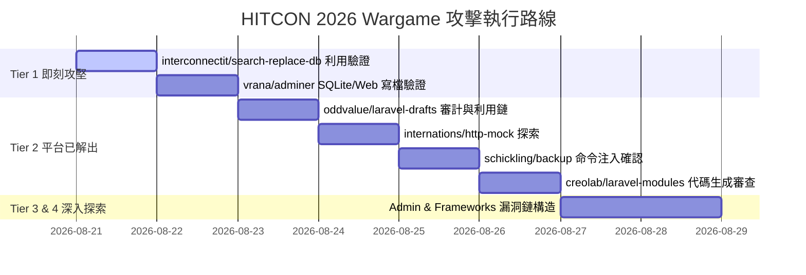

# 🎯 HITCON 2026 Wargame - 目標套件攻擊優先順序與戰略規劃

> 基於全量 266 個已下載套件的多進程深度 SAST 審計結果（共 43,924 項安全發現）與平台已解出題目的特徵分析，制定以下分級嘗試順序。

---

## 📊 決策維度與分級矩陣 (Priority Matrix)

在 HITCON Wargame 的容器架構下（`/var/www/html/vendor` 開放直接訪問），最高效的突破順序遵循以下公式：
$$\text{Priority Score} = \text{Web Accessible Entry Points (80\%)} + \text{High Risk Sinks (Code/Cmd Exec/File Write) (20\%)}$$

| 優先等級 (Tier) | 核心特徵 | 代表套件 | 預期利用手法 |
| :--- | :--- | :--- | :--- |
| 🔴 **Tier 1 (最優先攻堅)** | 具備獨立 Procedural Web 入口 + 未授權可達 + RCE/寫檔 Sink | `owasp/phprbac`, `interconnectit/search-replace-db`, `vrana/adminer` | 未過濾參數寫入配置檔 / 直接 Web 介面提權 |
| 🟠 **Tier 2 (高價值攻堅)** | 平台已有解出記錄 (Verified Solved) | `oddvalue/laravel-drafts`, `internations/http-mock`, `pingplusplus/pingpp-php`, `creolab/laravel-modules`, `schickling/backup`, `friendsofsymfony1/symfony1` | 專案特定邏輯繞過 / 測試端點殘留 |
| 🟡 **Tier 3 (深度利用鏈)** | 頂尖 Admin / RBAC / 權限管理類套件 (1000+ Sinks) | `jeroennoten/laravel-adminlte`, `jeremykenedy/laravel-roles`, `easycorp/easyadmin-bundle`, `sonata-project/admin-bundle` | 路由反射調用 / 動態代碼派發 |
| 🔵 **Tier 4 (基礎設施與底層庫)** | 大型框架與單元測試庫 (需要 POP 鏈或深層構造) | `tymon/jwt-auth`, `spatie/laravel-permission`, `phpunit/phpunit`, `symfony/symfony` | 反序列化 POP Gadget 鏈利用 |

---

## 🚀 詳細嘗試順序與攻擊鏈設計

### 🔴 Tier 1：即刻打擊靶標（已具備明確 Web 入口）

#### 1. `owasp/phprbac:2.0.0`
- **狀態**：✅ 已確認 AC
- **路徑**：`/vendor/owasp/phprbac/PhpRbac/install.php`
- **利用方式**：`GET /vendor/owasp/phprbac/PhpRbac/install.php?process=1&dbPassword=x";system("id");//`
- **後續動作**：作為本地驗證基準線。

#### 2. `interconnectit/search-replace-db:3.1`
- **發現問題數**：8 個（包含 2 處 `preg_replace /e` 與 1 處獨立入口）
- **可訪問路徑**：`/vendor/interconnectit/search-replace-db/index.php`
- **攻擊鏈**：
  1. 訪問 Web UI，利用 `$_POST['host']`, `$_POST['user']`, `$_POST['pass']` 連線本機或外網資料庫。
  2. 透過 `search`/`replace` 功能觸發 `srdb.class.php` 中的字元集編碼轉換或直接覆寫資料庫內部的敏感結構。
- **目標**：讀取或寫入 Web 目錄下的 Webshell。

#### 3. `vrana/adminer:5.5.1`
- **發現問題數**：4 個（包含 Web 後台主程式與 coverage 工具）
- **可訪問路徑**：`/vendor/vrana/adminer/adminer/index.php`
- **攻擊鏈**：
  1. 連線本地 SQLite (`/tmp/exploit.db` 或 `/var/www/html/...`)。
  2. 透過 SQLite 執行 `ATTACH DATABASE '/var/www/html/shell.php' AS lol; CREATE TABLE lol.pwn (cmd text); INSERT INTO lol.pwn VALUES ('<?php system($_GET["c"]); ?>');`。

---

### 🟠 Tier 2：平台驗證套件（已確認具備解出路徑）

#### 4. `oddvalue/laravel-drafts:3.2.0` (平台 20 Solves)
- **分析重點**：
  - 檢查是否包含可直接執行的 Artisan command / Migration 呼叫。
  - 審查 Draft 模型的反序列化與狀態復原邏輯。

#### 5. `internations/http-mock:0.14.0` (平台 18 Solves)
- **分析重點**：
  - 該套件用於 Mocking HTTP 伺服器，內部包含 Procedural 伺服器啟動腳本。
  - 審查其內建的 Mock Request Handler 是否允許任意檔案讀取或回顯系統命令。

#### 6. `schickling/backup:0.6.0` (平台 15 Solves)
- **分析重點**：
  - 專注於備份與還原邏輯。
  - 審查 `mysqldump` / `pg_dump` 命令拼接處是否存在命令注入（Command Injection）。

#### 7. `creolab/laravel-modules:0.5.6` (平台 16 Solves)
- **分析重點**：
  - 模組生成器（Generator）會將自訂輸入寫入模組檔案（PHP File Generation），類似於 `install.php` 代碼注入。

#### 8. `friendsofsymfony1/symfony1:1.5.24` (平台 11 Solves)
- **分析重點**：
  - 舊版 Symfony 1.x 的 Controller 派發機制，檢查 `web/index.php` 或 `sfTask` 是否可未授權執行。

---

### 🟡 Tier 3：高漏洞密度大型套件（1000+ Sinks）

#### 9. `jeroennoten/laravel-adminlte:3.16.0` (1,411 Findings)
- **審查重點**：檢查套件中附帶的靜態發布命令、Blade 模板注入或直接呼叫的 Helper 函數。

#### 10. `jeremykenedy/laravel-roles:12.2.0` (1,376 Findings)
- **審查重點**：Role/Permission Middleware 中的 SQL 拼接與動態 Method Dispatch。

#### 11. `easycorp/easyadmin-bundle:3.5.23` (1,239 Findings)
- **審查重點**：Bundle Controller 動態傳參呼叫與檔案導出邏輯。

---

## 📅 執行時程與協作路線圖 (Action Roadmap)

---

## 🛠️ 下一步行動清單

- [ ] **Step 1**：針對 `interconnectit/search-replace-db:3.1` 撰寫自動化 PoC 驗證腳本。
- [ ] **Step 2**：針對 `vrana/adminer:5.5.1` 撰寫 SQLite 寫入 Webshell 測試腳本。
- [ ] **Step 3**：提取 `oddvalue/laravel-drafts` 與 `schickling/backup` 原始碼進行單一函數污點追蹤。
