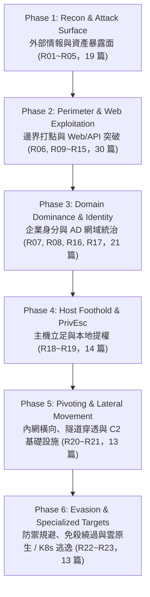

# 🚀 現代紅隊實戰通關課表與作戰主線 (Red Team Career & Operational Curriculum)

> 💡 **核心精神**：本文件將紅隊 23 大領域與 110 項實戰 Playbook，由「扁平分散的技術手冊」昇華為**「以作戰鏈 (Cyber Kill Chain) 與企業實戰滲透為核心的修課主線」**。  
> **徹底打破平鋪號碼帶來的結構割裂**，依照真實滲透作戰全生命週期推進：從外網情報偵察、邊界打點突破、AD 網域統治，推進至本機提權、隧道 C2 與前沿防禦規避/雲原生攻防。  
> 🛡️ **作戰執行與交戰規則指引**：在實際按課表進行各階段演練前，請務必先參閱 [【紅隊作戰編排層 (Operations)】](operations/README.md)（掌握授權邊界、進入路徑路由、立足點躍遷、成功驗證與覆盤沉澱之作戰推進閉環）。

---

## 🧭 紅隊修課階段 (Phase 1 ~ Phase 6) 全景流向

---

## 🎯 學習負擔消解：三層能力分類 (Core / Specialization / Advanced)

面對 110 篇原子手冊，**不需要死記硬背**！請依據三層分流逐步推進：

| 能力層級 | 包含篇數 | 核心定位與目標 | 適合對象 |
| :--- | :---: | :--- | :--- |
| **🎯 核心主幹 (Core Track)** | **40 篇** | 外網快速打點、注入漏洞利用、Kerberoasting/PtH/DCSync、Linux/Windows 經典提權、Chisel/Ligolo-ng 隧道、Sliver C2 之**絕對必修**。掌握此 40 篇即具備企業全鏈路滲透的主力作戰能力！ | 滲透測試員、競賽攻防手、紅隊主力 |
| **🔬 領域專精 (Specialization Track)** | **48 篇** | 請求走私 (Smuggling)、反序列化 (Deserialization)、AD CS (ESC1~ESC8)、UAC Bypass、DPAPI 萃取、FRP/DNS 隧道、Havoc C2、Docker 逃逸。按滲透目標情境與隊伍分工專攻。 | 資深滲透顧問、AD 專案研究員、內網/雲端專家 |
| **🚀 高階前沿 (Advanced Track)** | **22 篇** | 邊界架構拓撲推導、Golden/Silver Ticket 偽造、DCShadow 注入、LSASS PPL 規避、Sleep Mask 記憶體混淆、Direct/Indirect Syscalls、Perun's Fart 脫鉤、K8s RBAC 提權。 | 紅隊架構師、APT 模擬專家、全真攻防推演負責人 |

---

## 🌐 Phase 1: Reconnaissance & Attack Surface (外部情報與資產暴露面)

> 💡 **階段目標**：精確繪製目標組織的外網疆界，從法律實體、ASN、DNS 命名空間，逐步收斂至可攻擊的對外暴露服務，絕不在未授權目標浪費彈藥。

### 必修核心清單
1. **R01 企業法人與人員情資**：組織架構關聯推導 (`R01.1`)、公開人員與郵箱枚舉 (`R01.2`)。
2. **R02 公開數位足跡**：開放網路與搜尋引擎偵察 (`R02.1`)、公開代碼倉庫金鑰洩漏 (`R02.2`)。
3. **R03 域名命名空間**：WHOIS/RDAP 情資 (`R03.1`)、權威 DNS 枚舉 (`R03.2`)、憑證透明度 CT Logs (`R03.4`)、候選主機名發現 (`R03.5`)。
4. **R04 外部基礎設施歸屬**：IP/ASN/網段歸屬驗證 (`R04.1`)、CDN 與邊界歸屬邊界界定 (`R04.2`)。
5. **R05 外部暴露技術驗證**：網路掃描情資 (`R05.1`)、開放通訊埠探測 (`R05.3`)、服務指紋辨識 (`R05.4`)、虛擬主機枚舉 (`R05.5`)、Web 路徑探測 (`R05.6`)。

| 領域編號 | 涵蓋技術手冊路徑 | 核心重點 |
| :--- | :--- | :--- |
| **R01** | [`playbooks/phase_1_recon_surface/R01_organization_public_identity/`](playbooks/phase_1_recon_surface/R01_organization_public_identity/) | 企業架構、職能人員與社交工程目標候選 |
| **R02** | [`playbooks/phase_1_recon_surface/R02_public_digital_footprint/`](playbooks/phase_1_recon_surface/R02_public_digital_footprint/) | 開放原始碼洩漏、搜尋引擎 Dorking |
| **R03** | [`playbooks/phase_1_recon_surface/R03_domain_namespace_naming/`](playbooks/phase_1_recon_surface/R03_domain_namespace_naming/) | DNS 字典枚舉、子域名接管預警、CT 日誌 |
| **R04** | [`playbooks/phase_1_recon_surface/R04_external_infrastructure_ownership/`](playbooks/phase_1_recon_surface/R04_external_infrastructure_ownership/) | BGP 宣告、ASN 歸屬、CDN 真實 IP 穿透辨析 |
| **R05** | [`playbooks/phase_1_recon_surface/R05_external_technical_exposure/`](playbooks/phase_1_recon_surface/R05_external_technical_exposure/) | L4 埠掃描、L7 服務指紋、目錄與 VHost Fuzzing |

---

## 🎯 Phase 2: Perimeter & Web Exploitation (邊界打點與 Web/API 突破)

> 💡 **階段目標**：獲取企業初始立足點 (Initial Foothold)。整合外部認證猜解與應用程式層漏洞，撕開外網防線進入內網。

### 必修核心清單
1. **R06 憑證秘密恢復與猜解**：外部密碼噴灑 (`R06.3`)、撞庫攻擊 (`R06.4`)、離線 Hash 破解 (`R06.1`)。
2. **R09 身分驗證與狀態**：BOLA / 物件層級存取控制失效 (`R09.3`)、功能層級存取控制失效 BFLA (`R09.4`)。
3. **R10 語法解析與直譯器注入**：SQL 注入 (`R10.1`)、作業系統命令注入 (`R10.2`)、伺服端模板注入 SSTI (`R10.3`)。
4. **R11 伺服端資源與後端信任**：伺服端請求偽造 SSRF (`R11.1`)、任意檔案讀取 / 路徑穿越 (`R11.2`)、本機檔案包含 LFI (`R11.3`)。
5. **R12 物件反序列化與重構**：不安全反序列化 (`R12.1`)、XML 外部實體注入 XXE (`R12.2`)。
6. **R13 訊息封裝與中介代理**：HTTP 請求走私 Smuggling (`R13.1`)、Web 快取投毒 (`R13.2`)。
7. **R14 瀏覽器同源策略信任**：跨站腳本 XSS (`R14.1`~`R14.3`)、跨站請求偽造 CSRF (`R14.4`)、CORS 錯誤配置 (`R14.5`)。
8. **R15 業務工作流與邏輯漏洞**：狀態機繞過 (`R15.1`)、重放攻擊 (`R15.2`)、併發競態條件 Race Condition (`R15.3`)。

| 領域編號 | 涵蓋技術手冊路徑 | 核心重點 |
| :--- | :--- | :--- |
| **R06** | [`playbooks/phase_2_perimeter_web/R06_credential_secret_recovery_guessing_reuse/`](playbooks/phase_2_perimeter_web/R06_credential_secret_recovery_guessing_reuse/) | OWA / VPN 密碼噴灑、雜湊破解與秘密復原 |
| **R09** | [`playbooks/phase_2_perimeter_web/R09_application_authentication_session_authorization_state/`](playbooks/phase_2_perimeter_web/R09_application_authentication_session_authorization_state/) | 權限越權、Session 偽造與重放繞過 |
| **R10** | [`playbooks/phase_2_perimeter_web/R10_interpreter_query_expression_injection/`](playbooks/phase_2_perimeter_web/R10_interpreter_query_expression_injection/) | AST 語法樹破壞、RCE 命令執行 |
| **R11** | [`playbooks/phase_2_perimeter_web/R11_server_side_resource_backend_trust/`](playbooks/phase_2_perimeter_web/R11_server_side_resource_backend_trust/) | 突破內網隔離、雲端中繼資料獲取、敏感檔洩漏 |
| **R12** | [`playbooks/phase_2_perimeter_web/R12_serialization_object_binding_state_reconstruction/`](playbooks/phase_2_perimeter_web/R12_serialization_object_binding_state_reconstruction/) | 惡意 Gadget 構造、XML 實體解析濫用 |
| **R13** | [`playbooks/phase_2_perimeter_web/R13_application_message_framing_routing_intermediary_semantics/`](playbooks/phase_2_perimeter_web/R13_application_message_framing_routing_intermediary_semantics/) | 前後端長度邊界不一致利用、快取投毒 |
| **R14** | [`playbooks/phase_2_perimeter_web/R14_browser_cross_origin_trust/`](playbooks/phase_2_perimeter_web/R14_browser_cross_origin_trust/) | 客戶端憑證劫持、同源政策破壞 |
| **R15** | [`playbooks/phase_2_perimeter_web/R15_application_workflow_business_logic_integrity/`](playbooks/phase_2_perimeter_web/R15_application_workflow_business_logic_integrity/) | 業務邏輯邊界突破、高併發競態套利 |

---

## 👑 Phase 3: Domain Dominance & Identity (企業身分與 AD 網域統治)

> 💡 **階段目標**：全面掌控企業 Active Directory 基礎設施。將協定票據、存取控制 ACL、目錄複製 DRSUAPI 與企業憑證服務 (AD CS) 融會貫通。

### 必修核心清單
1. **R07 企業身分協定與票據**：AS-REP Roasting (`R07.1`)、Kerberoasting (`R07.2`)、NTLM Pass-the-Hash (`R07.3`)、TGT 重放 (`R07.4`)、黃金票據偽造 (`R07.6`)、白銀票據偽造 (`R07.7`)。
2. **R08 目錄授權與 ACL 提權路徑**：BloodHound 圖譜收集與分析 (`R08.1`, `R08.2`)、群組隸屬狀態確認 (`R08.3`)、DACL 授權濫用 GenericAll/WriteDacl (`R08.4`)、GPO 劫持 (`R08.5`)。
3. **R16 目錄複製與同步原語**：DCSync 網域憑證複製 (`R16.1`)、DCShadow 惡意目錄狀態注入 (`R16.2`)。
4. **R17 企業憑證服務 (AD CS) 濫用**：使用者指定 SAN 濫用 ESC1 (`R17.1`)、危險 EKU 濫用 ESC2 (`R17.2`)、註冊代理濫用 ESC3 (`R17.3`)、模板 ACL 濫用 ESC4 (`R17.4`)、CA 屬性濫用 ESC5~ESC8 (`R17.5`~`R17.7`)。

| 領域編號 | 涵蓋技術手冊路徑 | 核心重點 |
| :--- | :--- | :--- |
| **R07** | [`playbooks/phase_3_domain_dominance/R07_enterprise_authentication_protocol_ticket_semantics/`](playbooks/phase_3_domain_dominance/R07_enterprise_authentication_protocol_ticket_semantics/) | Kerberos/NTLM 票據生命週期與橫向鑑別 |
| **R08** | [`playbooks/phase_3_domain_dominance/R08_directory_authorization_delegation_privilege_paths/`](playbooks/phase_3_domain_dominance/R08_directory_authorization_delegation_privilege_paths/) | 圖論最短路徑計算、ACL 委派濫用、GPO 劫持 |
| **R16** | [`playbooks/phase_3_domain_dominance/R16_directory_replication_synchronization_semantics/`](playbooks/phase_3_domain_dominance/R16_directory_replication_synchronization_semantics/) | DRSUAPI 協定呼叫、全量 NTDS.dit 雜湊導出 |
| **R17** | [`playbooks/phase_3_domain_dominance/R17_enterprise_certificate_identity_enrollment_trust/`](playbooks/phase_3_domain_dominance/R17_enterprise_certificate_identity_enrollment_trust/) | AD CS 現代憑證攻擊全景 (ESC1~ESC8)、憑證鏈信任劫持 |

---

## ⚡ Phase 4: Host Foothold & PrivEsc (主機立足與本地提權)

> 💡 **階段目標**：突破作業系統內部防護邊界。從低權限 Shell 躍遷至系統最高特權 (`root` / `NT AUTHORITY\SYSTEM`)，並提取本機憑證作為內網橫向素材。

### 必修核心清單
1. **R18 Linux 主機本地提權**：SUID/SGID 特權二進位 (`R18.1`)、Sudo 弱配置 (`R18.2`)、核心漏洞 Dirty Pipe (`R18.3`)、Capabilities 濫用 (`R18.4`)、定時任務與通配符 (`R18.5`)、NFS no_root_squash (`R18.6`)。
2. **R19 Windows 主機本地提權**：未加引號服務路徑 (`R19.1`)、Token 模擬 Potato 系列 (`R19.2`)、AlwaysInstallElevated (`R19.3`)、UAC Bypass (`R19.4`)、DLL 搜尋順序劫持 (`R19.5`)、SAM/SYSTEM 轉儲 (`R19.6`)、LSASS 記憶體導出與 PPL 規避 (`R19.7`)、DPAPI MasterKey 解密 (`R19.8`)。

| 領域編號 | 涵蓋技術手冊路徑 | 核心重點 |
| :--- | :--- | :--- |
| **R18** | [`playbooks/phase_4_host_privesc/R18_linux_host_privilege_escalation/`](playbooks/phase_4_host_privesc/R18_linux_host_privilege_escalation/) | Linux SUID、Sudoers、POSIX Capabilities、Dirty Pipe 核心提權 |
| **R19** | [`playbooks/phase_4_host_privesc/R19_windows_host_privilege_escalation/`](playbooks/phase_4_host_privesc/R19_windows_host_privilege_escalation/) | Windows 服務、Token 模擬、UAC 繞過、LSASS 轉儲、DPAPI 憑證萃取 |

---

## 🌪️ Phase 5: Pivoting & Lateral Movement (內網橫向與穿透代理)

> 💡 **階段目標**：撕開企業多層次網路隔離。建立高效能內網穿透隧道與現代化 C2 基礎設施，實施無檔案橫向漫遊與深層控制。

### 必修核心清單
1. **R20 網路隧道穿透與跳板代理**：Chisel 反向 SOCKS5 (`R20.1`)、Ligolo-ng TUN 代理 (`R20.2`)、SSH 動態轉發 (`R20.3`)、FRP 高性能穿透 (`R20.4`)、DNS/ICMP 隱蔽隧道 (`R20.5`)、Socat/Netsh PortProxy (`R20.6`)、SMB 命名管道隧道 (`R20.7`)。
2. **R21 命令與控制基礎設施 (C2)**：Sliver C2 部署操作 (`R21.1`)、Malleable C2 流量偽裝 (`R21.2`)、Havoc C2 Demon Agent (`R21.3`)、Sleep Mask 記憶體混淆 (`R21.4`)、WMI/WinRM 無檔案橫向 (`R21.5`)、RDP 會話劫持與 Shadow (`R21.6`)。

| 領域編號 | 涵蓋技術手冊路徑 | 核心重點 |
| :--- | :--- | :--- |
| **R20** | [`playbooks/phase_5_pivoting_c2/R20_network_tunneling_proxy_pivoting/`](playbooks/phase_5_pivoting_c2/R20_network_tunneling_proxy_pivoting/) | SOCKS5 代理、L3 TUN 網卡跳板、DNS/ICMP 穿透、SMB 命名管道 |
| **R21** | [`playbooks/phase_5_pivoting_c2/R21_command_and_control_infrastructure/`](playbooks/phase_5_pivoting_c2/R21_command_and_control_infrastructure/) | Sliver/Havoc C2 架構、Malleable 偽裝、Sleep Mask 混淆、WMI/WinRM 橫向 |

---

## 🥷 Phase 6: Evasion & Specialized Targets (防禦規避與前沿環境攻防)

> 💡 **階段目標**：穿透現代 EDR/XDR 動態防禦矩陣，實現端點記憶體免殺；攻破雲原生架構與容器邊界，統治公有雲與 Kubernetes 叢集。

### 必修核心清單
1. **R22 執行期防禦規避與端點對抗**：直接系統調用 Direct Syscalls (`R22.1`)、AMSI/ETW 記憶體動態修補 (`R22.2`)、進程鏤空 Process Hollowing (`R22.3`)、Early Bird APC 佇列注入 (`R22.4`)、PPID 欺騙與參數偽裝 (`R22.5`)、Perun's Fart 磁碟脫鉤 (`R22.6`)、Shellcode UUID 編碼混淆 (`R22.7`)、Defender 排除路徑濫用 (`R22.8`)。
2. **R23 雲端基礎設施與容器逃逸**：雲端 IAM 提權與中繼資料憑證濫用 (`R23.1`)、Kubernetes 特權容器逃逸 (`R23.2`)、雲端儲存桶枚舉與子網域接管 (`R23.3`)、Docker Socket 掛載逃逸 (`R23.4`)、Kubernetes RBAC 提權與全叢集 Secrets 轉儲 (`R23.5`)。

| 領域編號 | 涵蓋技術手冊路徑 | 核心重點 |
| :--- | :--- | :--- |
| **R22** | [`playbooks/phase_6_evasion_cloud/R22_defense_evasion_endpoint_runtime/`](playbooks/phase_6_evasion_cloud/R22_defense_evasion_endpoint_runtime/) | Direct Syscalls、AMSI/ETW Patch、Early Bird APC、PPID 欺騙、Unhooking |
| **R23** | [`playbooks/phase_6_evasion_cloud/R23_cloud_container_infrastructure_exploitation/`](playbooks/phase_6_evasion_cloud/R23_cloud_container_infrastructure_exploitation/) | 雲端 IAM/Metadata 濫用、S3 儲存桶接管、Docker Socket 逃逸、K8s RBAC 提權 |
