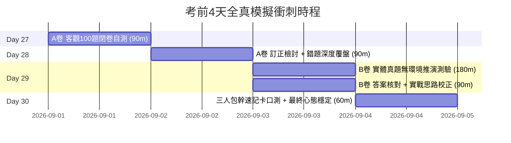

# 金盾獎 & 全國技能競賽 決戰衝刺自評題庫 (Final Mock Exams)

> **建立宗旨**：  
> 本專題目錄專為參賽隊伍在最後衝刺期（Day 27 ～ Day 30）打造。  
> 徹底告別「只有 Flag 卻沒題目」、「還要自己編 PCAP 或自架環境才能解題」的困擾！  
> 本目錄將**客觀知識題**與**實體真題演練**完全獨立成「**試卷題本**」與「**解答解析手冊**」，並將所有網路封包截圖/文字流、取證日誌、十六進位特徵直接印刷於題本中，隊員可隨時離線模擬實戰測驗！

---

## 模擬測驗結構與檔案導覽

| 序號 | 檔案名稱 | 適用階段 | 題型與內容說明 | 建議測驗時間 |
| :--- | :--- | :--- | :--- | :--- |
| **00** | [README.md](README.md) | 全程指南 | 測驗指引、各科配分權重、自評成績表與團隊作戰策略 | - |
| **01** | [mock_exam_a_100q_questions.md](mock_exam_a_100q_questions.md) | Day 27 | **客觀選擇題試卷**（純題本，無答案）。精選 100 道單選題，涵蓋 7 大核心資安領域，附標準答題卡 | 90 分鐘 |
| **02** | [mock_exam_a_100q_solutions.md](mock_exam_a_100q_solutions.md) | Day 28 | **A卷標準答案與逐題精闢解析**。包含標準答案速查表、正解依據、誘答干擾項辨析、必背知識點 | 自評 60 分鐘 |
| **03** | [mock_exam_b_lab_questions.md](mock_exam_b_lab_questions.md) | Day 29 | **實體競賽真題演練題本**（純題本，無答案）。完整收錄 IR 事件應變 (23題)、系統安全加固 (28題)、CTF I 隱寫封包取證 (30題)、CTF II 實戰靶機 (12題)。**所有日誌片段、DNS序列、HTTP封包截圖已內嵌**，看題即可推演！ | 180 分鐘 |
| **04** | [mock_exam_b_lab_solutions.md](mock_exam_b_lab_solutions.md) | Day 29-30 | **B卷官方解答與操作還原手冊**。包含全題目 Flag、Wireshark 過濾表達式、Volatility 指令、Python 解碼腳本與思路復盤 | 覆盤 90 分鐘 |
| **05** | [high_frequency_flashcards.md](high_frequency_flashcards.md) | Day 30 | **考前口試抽測速記卡**。針對三人隊伍的角色分工（組長/總架構、Web/密碼專員、系統/取證/逆向專員）設計的快問快答與衝刺清單 | 60 分鐘 |
| **06** | [cheatsheets/](cheatsheets/README.md) | 隨時查閱 | **考前核心速查手冊專區**。包含資安檢定核心名詞對照表、網路安全實務命令 (`nmap`/`wireshark`/`iptables`) 速查表 | 隨時複習 |

---

## 衝刺自評時程建議 (Day 27 ~ Day 30)

### 1. Day 27：客觀題極限壓測（A卷）
- **測驗規則**：嚴格計時 90 分鐘，閉卷測驗（不可查閱 Google、不可使用 AI、不可看解析）。
- **作答方式**：在 `mock_exam_a_100q_questions.md` 末尾的【標準答題卡】填入答案，或寫在白紙上。
- **合格門檻**：80 分以上為安全線；未達 75 分者須於 Day 28 加倍強化弱項領域。

### 2. Day 28：A卷精準訂正與錯題歸納
- **核對答案**：開啟 `mock_exam_a_100q_solutions.md`。
- **錯題統計**：將錯題分類至 7 大領域，統計各領域失分率，鎖定薄弱模組。
- **溯源學習**：針對錯誤題目，回翻教材或講義對應章節，徹底搞懂誘答選項為什麼是錯的。

### 3. Day 29：實體操作與情境推演題測驗（B卷）
- **測驗方式**：開啟 `mock_exam_b_lab_questions.md`，題本內已印出所有封包數據、十六進位 Hex Dump、日誌截圖。
- **團隊協作**：
  - **隊員 A（Web & 密碼）**：主攻 CTF I 的 Web 與加密題型。
  - **隊員 B（系統 & 網路）**：主攻 IR 事件應變與 Hardening 加固策略題。
  - **隊員 C（鑑識 & 封包）**：主攻 CTF I 的 DNS/PCAP 封包隱寫與 CTF II 取證題。
- **覆盤校正**：對照 `mock_exam_b_lab_solutions.md`，確認每位隊員的推導思路與官方標準解答是否一致。

### 4. Day 30：三人包幹口測與考前速記檢定
- 使用 `high_frequency_flashcards.md` 進行面對面互相抽考，每人輪流回答 10 題核心考點（如常見端口、Event ID、SQLi 語法、Wireshark 過濾器），檢視瞬時反應速度。

---

## 團隊自評成績表 (Scorecard)

請於測驗完成後將團隊各成員成績登記於下表，作為正式上場之信心指標：

| 成員名稱 | 負責角色 | A卷得分 (/100) | B卷負責模組得分率 (%) | 弱項領域與加強備註 | 簽署確認 |
| :--- | :--- | :--- | :--- | :--- | :--- |
| **隊員 1** | 組長 / 總體架構 & 法規 | _____ / 100 | _____ % | | [ ] 通過 |
| **隊員 2** | Web 安全 & 密碼應用 | _____ / 100 | _____ % | | [ ] 通過 |
| **隊員 3** | 系統加固 & 封包取證 | _____ / 100 | _____ % | | [ ] 通過 |
| **團隊總評** | **團隊平均得分** | _____ / 100 | **B卷實體通關率**：____ % | **競賽目標：金盾獎前三名 / 全國技能競賽優勝** |

---
**祝全體隊員在金盾獎與全國技能競賽中旗開得勝、奪得佳績！**
