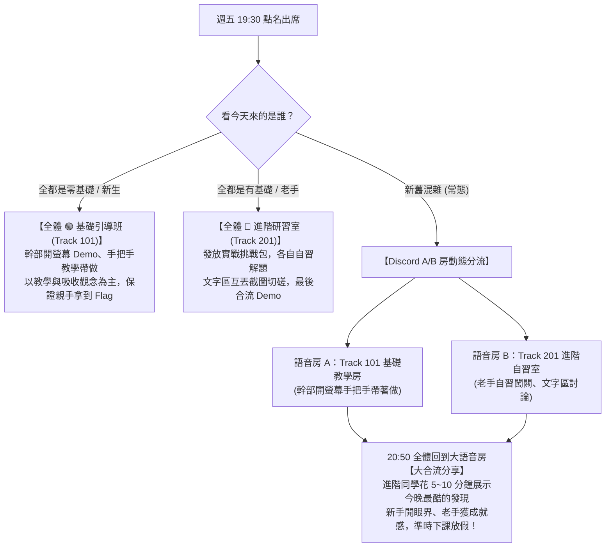

# NCtfU 資安社｜週五線上讀書會：雙軌分流自適應機制（教學 vs 研討）

版本：v2.5｜制定日期：2026-09-19｜狀態：全面落實「看今天來的是誰，動態切換基礎教學或進階自習」

---

## 🎯 什麼是「雙軌分流自適應」？

過去社團讀書會常面臨**「難度死局」**：
- 排太深：大一新手聽不懂、不敢開麥，第二週直接退群。
- 排太淺：想備戰競賽的老手覺得浪費時間、不來了。
- 當晚來的人程度每次都不同，固定課表直接卡死。

因此，本學期週五讀書會**不走單一固定難度**，而是**「以當晚出席人員結構，現場動態分流」**：

---

## 📊 兩大軌道實務對比

| 比較維度 | 🟢 Track 101：基礎引導班 (教學為主) | 🔴 Track 201：進階研習室 (自習研討) |
| :--- | :--- | :--- |
| **目標對象** | 零基礎、大一新生、社課跟不上想補底子者 | 有基礎、想打金盾/技能競賽/CTF 的老手 |
| **運作型態** | **幹部開螢幕手把手教學、步步拆解** | **各自獨立挑戰自習、文字區互助切磋** |
| **主持人心態** | **帶路教練**（確保今晚一定能親手拿到 1 個 Flag） | **計時同儕**（不講課，各憑本事破關） |
| **環境門檻** | **零安裝負擔**：只用瀏覽器 DevTools、CyberChef、基本 Wireshark | **實戰工具鏈**：Burp Suite、CyberDefenders 日誌、HTB 靶機、Volatility 3 |
| **題目題材** | picoCTF 經典入門、基礎明文封包抓帳密、Linux 基本指令 | PortSwigger 漏洞利用、CyberDefenders 深度鑑識、真實 C2 流量 |
| **攻防時間分配** | **40 分鐘攻擊帶做 ➔ 30 分鐘封包抓自己** | **40 分鐘漏洞利用 ➔ 30 分鐘日誌取證** |

---

## 📚 課表入口與相關文件

* 👉 **[14 週完整雙軌自適應課表 (v2.5 最新實行版)](curriculum_14weeks.md)**：包含每週核心主題、Track 101 與 Track 201 每週題目對照表
* 👉 **[紅藍對稱專案參考](purple_team_ref.md)**：紅藍對稱專項知識點與對抗參考
* 👉 **[歷史存檔與背景脈絡](archive/goals_and_vision.md)**：讀書會創立理念與投入考量
