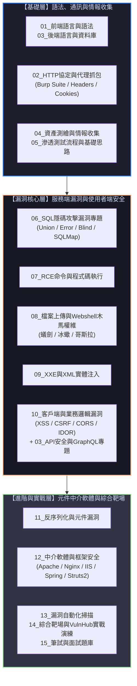
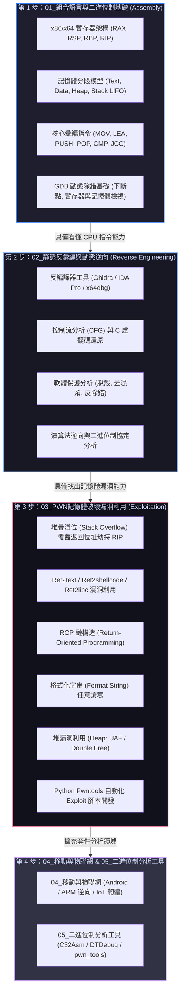
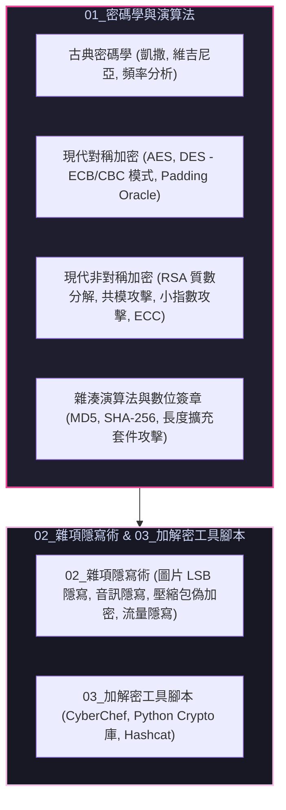
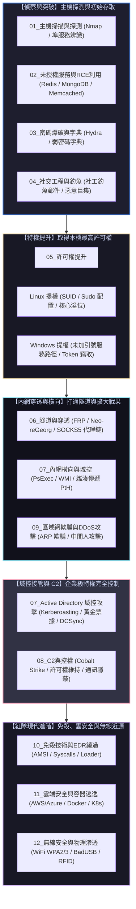
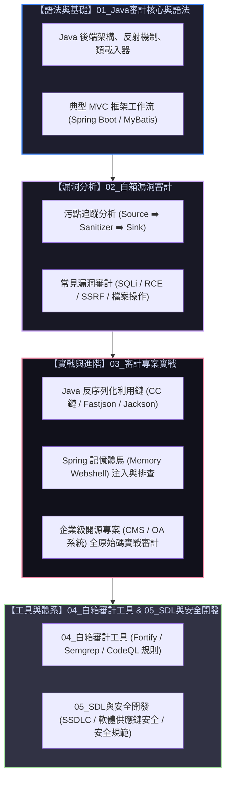
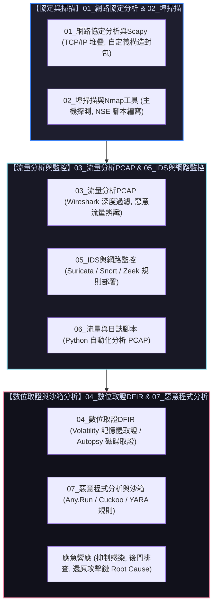
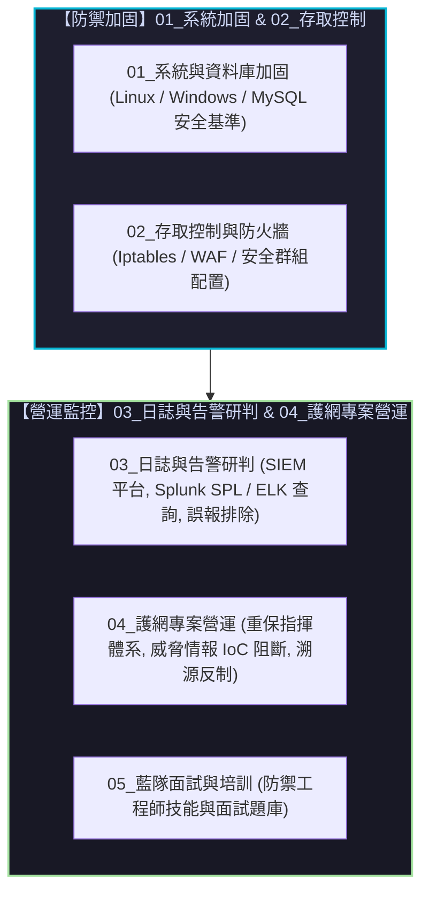

# 🗺️ 資訊安全全域知識領域演進地圖 (security_domains_map.md)

> [!IMPORTANT]
> **檔案定位**：本檔案依據資安核心九大技術領域（`01` 至 `09`）建立，為全體成員與組長提供**「資安各核心領域的內在構成邏輯、技術點演進關係與全景學習路徑」**。
> 幫助成員在進入各實戰章節或 90-Runs 課表前，清楚理解**「各技術領域在整體資安體系中的角色與前後依賴關係」**。

---

## 🧭 全景總覽：九大資安領域體系與全域技能樹

```mermaid
flowchart TD
    ROOT["🛡️ 資訊安全全域攻防體系"]
    
    ROOT --> D1["📁 01_Web安全<br>(Web 應用與 API 安全)"]
    ROOT --> D2["📁 02_二進位制與逆向<br>(底層彙編、逆向與 PWN)"]
    ROOT --> D3["📁 03_密碼學與隱寫<br>(加解密演算法與 Misc)"]
    ROOT --> D4["📁 04_系統與內網安全<br>(系統提權、內網滲透與 AD 域控)"]
    ROOT --> D5["📁 05_程式碼審計與安全開發<br>(白箱原始碼審計與 DevSecOps)"]
    ROOT --> D6["📁 06_網路安全與數位取證<br>(封包分析、取證與 IDS)"]
    ROOT --> D7["📁 07_藍隊防禦與護網營運<br>(系統加固、日誌研判與 SOC)"]
    ROOT --> D8["📁 08_通用學習與面試庫<br>(CTF Writeup、證照與面試)"]
    ROOT --> D9["📁 09_基礎設施與運營環境<br>(靶場、虛擬機器與開發環境)"]

    style ROOT fill:#1e293b,stroke:#3b82f6,stroke-width:3px,color:#ffffff
    style D1 fill:#0f172a,stroke:#3b82f6,stroke-width:2px,color:#ffffff
    style D2 fill:#0f172a,stroke:#ef4444,stroke-width:2px,color:#ffffff
    style D3 fill:#0f172a,stroke:#ec4899,stroke-width:2px,color:#ffffff
    style D4 fill:#0f172a,stroke:#10b981,stroke-width:2px,color:#ffffff
    style D5 fill:#0f172a,stroke:#f59e0b,stroke-width:2px,color:#ffffff
    style D6 fill:#0f172a,stroke:#8b5cf6,stroke-width:2px,color:#ffffff
    style D7 fill:#0f172a,stroke:#06b6d4,stroke-width:2px,color:#ffffff
    style D8 fill:#0f172a,stroke:#64748b,stroke-width:2px,color:#ffffff
    style D9 fill:#0f172a,stroke:#64748b,stroke-width:2px,color:#ffffff
```

---

## 📁 01_Web安全 (Web 應用與 API 安全)

Web 安全的核心本質是**「不可信任的使用者輸入突破邊界並被伺服器/瀏覽器解析執行」**。本模組目錄依序從通訊基礎、注入破壞到框架與實戰演練：

---

## 📁 02_二進位制與逆向 (二進位制底層、逆向與 PWN)

二進位制安全絕非單一學科，而是遵循**「語法地基 ➡️ 閱讀理解 ➡️ 漏洞破壞 ➡️ 高階擴充套件」**的嚴格演進體系：

---

## 📁 03_密碼學與隱寫 (密碼學演算法與 Misc)

---

## 📁 04_系統與內網安全 (系統提權、內網滲透與 AD 域控)

內網滲透的核心本質是**「邊界突破後的資訊收集、特權提升、內網穿透、橫向移動與 AD 域控完全接管」**：

---

## 📁 05_程式碼審計與安全開發 (白箱原始碼審計與 DevSecOps)

原始碼審計的核心是**「白箱視角：從資料輸入源 (Source) 追蹤到危險執行函式 (Sink) 的污點分析」**：

---

## 📁 06_網路安全與數位取證 (封包分析、取證與 IDS)

---

## 📁 07_藍隊防禦與護網營運 (系統加固、日誌研判與 SOC)

---

## 📁 08_通用學習與面試庫 ＆ 📁 09_基礎設施與運營環境

* **`08_通用學習與面試庫`**（職涯支援與賽事題解）：
  * `01_CTF競賽Writeup與題解` ｜ `02_CTF賽制介紹與平台指南` ｜ `03_SRC與認證` ｜ `04_通用基礎知識` ｜ `05_HR與跨領域面試`
* **`09_基礎設施與運營環境`**（實驗平台基石）：
  * `01_虛擬機與作業系統` (Kali, Ubuntu, Windows VM) ｜ `02_程式語言運行時` (Python, JDK, PHP) ｜ `03_Web與容器環境` (Docker, LAMP, Tomcat) ｜ `04_連線與傳輸工具` ｜ `05_綜合實驗環境`

---

## 📊 路線圖 (Month 1 ~ Month 6) 與倉庫目錄實體對照表

| 階段 (時程) | 🎯 核心學習主題 | 涵蓋之頂層目錄與核心子資料夾 |
| :--- | :--- | :--- |
| **Month 1** | **攻防雙軌基礎與工具鏈入門** | 📁 `01_Web安全` (01~05, 08) ＋ 📁 `02_二進制與逆向` (01, 05) ＋ 📁 `06_網路安全` (03) |
| **Month 2** | **服務端漏洞深入與二進位制破壞** | 📁 `01_Web安全` (06, 07, 09, 10) ＋ 📁 `02_二進制與逆向` (02) ＋ 📁 `04_系統與內網` (01~04) |
| **Month 3** | **企業內網滲透與框架漏洞實戰** | 📁 `04_系統與內網` (06~08 域控/C2) ＋ 📁 `01_Web安全` (11, 12 中介軟體/框架) ＋ 📁 `02_二進制` (ROP) |
| **Month 4** | **白箱原始碼審計與高階二進位制** | 📁 `05_代碼審計與安全開發` (01~04 Java/PHP 審計) ＋ 📁 `02_二進制` (Format String / Heap 堆漏洞) |
| **Month 5** | **企業藍隊防禦與數位取證** | 📁 `06_網路安全與數位取證` (04 取證) ＋ 📁 `07_藍隊防禦與護網` (01~04 加固/SIEM) ＋ 📁 `03_密碼學` |
| **Month 6** | **綜合實戰、靶場通關與職涯沖刺** | 📁 `01` (15 綜合靶場) ＋ 📁 `08_通用學習與面試庫` (01~05 題解/面試) ＋ 跨領域 AWD 攻防演練 |
